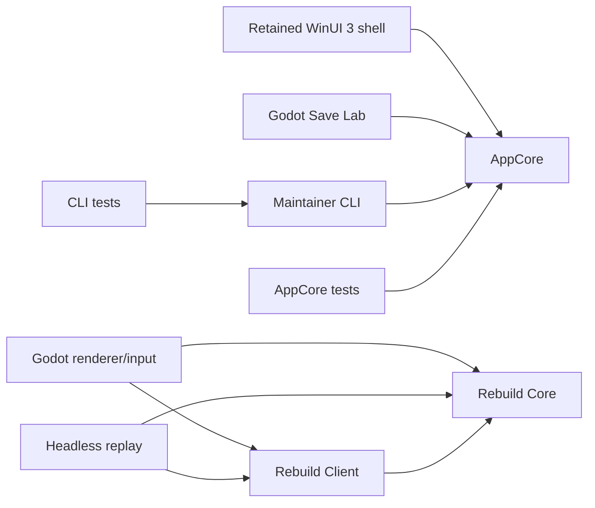

# Repository and Application Map

Status: active source-routing index
Last updated: 2026-09-07
Summary: stable ownership, dependency direction, and code-entry routing for the
Onslaught Toolkit repository and its Godot companion, retained WinUI, AppCore, CLI, rebuild, RE, and
support surfaces.

This index answers **where code and responsibility live**. It does not restate
what is currently proved or working. Use [`CURRENT_CAPABILITIES.md`](CURRENT_CAPABILITIES.md)
for demonstrated capability, [`GOAL.md`](GOAL.md) for desired outcomes,
[`developer_state.json`](developer_state.json) for resumable evidence pointers
(complete-RE replay selector: key `current_re_authority`),
[`reverse-engineering/RE-INDEX.md`](reverse-engineering/RE-INDEX.md) for retail
evidence routing, and [`rebuild/PROVENANCE.md`](rebuild/PROVENANCE.md) for the
rebuild's evidence and licence boundary. Do not embed volatile Gen/C1/OPAQUE
counts here.

## Dependency direction



The arrows are source dependencies, not priority. Full retail reverse
engineering, the 1:1 Godot rebuild, and the Godot toolkit companion are coequal
project outcomes. The companion and retained Windows adapters share AppCore.
The MIT companion has no dependency on the GPL rebuild or private retail assets.

| Project | Declared role and dependencies |
| --- | --- |
| [`OnslaughtToolkit.Godot`](companion/OnslaughtToolkit.Godot/OnslaughtToolkit.Godot.csproj) | .NET 8 Godot companion. Save Lab presentation, file selection and results; references AppCore only. |
| [`OnslaughtCareerEditor.WinUI`](OnslaughtCareerEditor.WinUI/OnslaughtCareerEditor.WinUI.csproj) | .NET 10 WinUI 3 executable. Owns the shell, pages, interaction, and presentation; references AppCore. |
| [`OnslaughtCareerEditor.AppCore`](OnslaughtCareerEditor.AppCore/OnslaughtCareerEditor.AppCore.csproj) | .NET 8/10 shared correctness layer. Owns file formats, guarded mutations, safe copies, patches, runtime services, catalogs, media, and lore; has no project reference. |
| [`OnslaughtCareerEditor.Cli`](OnslaughtCareerEditor.Cli/OnslaughtCareerEditor.Cli.csproj) | Windows-targeted, unshipped maintainer/agent adapter over AppCore. [`CLI.md`](CLI.md) owns its external contract. |
| [`OnslaughtCareerEditor.AppCore.Tests`](OnslaughtCareerEditor.AppCore.Tests/OnslaughtCareerEditor.AppCore.Tests.csproj) | Focused AppCore behavior and safety tests. |
| [`OnslaughtCareerEditor.Cli.Tests`](OnslaughtCareerEditor.Cli.Tests/OnslaughtCareerEditor.Cli.Tests.csproj) | CLI envelope and adapter tests. |
| [`OnslaughtCareerEditor.UiTests`](OnslaughtCareerEditor.UiTests/OnslaughtCareerEditor.UiTests.csproj) | Static and native WinUI checks plus shared product regressions. It references AppCore and drives built WinUI surfaces without making UI code the business-logic owner. |
| [`OnslaughtRebuild.Core`](rebuild/OnslaughtRebuild.Core/OnslaughtRebuild.Core.csproj) | Deterministic simulation truth; no presentation, filesystem, clock, process, network, or GPU dependency. |
| [`OnslaughtRebuild.Client`](rebuild/OnslaughtRebuild.Client/OnslaughtRebuild.Client.csproj) | Input-to-fixed-step and presentation-lifecycle adapter; references Core. |
| [`OnslaughtRebuild.Headless`](rebuild/OnslaughtRebuild.Headless/OnslaughtRebuild.Headless.csproj) | Command-tape replay and deterministic verification; references Client and Core. |
| [`OnslaughtRebuild.Godot`](rebuild/OnslaughtRebuild.Godot/OnslaughtRebuild.Godot.csproj) | Rendering, audio, native integration, and player input; references Client and Core. |

Host boundary: Linux owns native Godot, Core/Client/headless execution and the
portable Save Lab service. The full legacy AppCore suite, WinUI and CLI retain
Windows path/process/media behavior. The Windows VM remains staged and inactive.
[`VALIDATION.md`](VALIDATION.md) distinguishes focused service tests, native
runtime checks and unfinished acceptance.

[`OnslaughtCareerEditor.WinUI.slnx`](OnslaughtCareerEditor.WinUI.slnx) and
[`rebuild/OnslaughtRebuild.slnx`](rebuild/OnslaughtRebuild.slnx) are the
machine-readable project lists. [`rebuild/README.md`](rebuild/README.md) owns
the rebuild assembly contract in detail.

## Companion route

[`SaveLab.tscn`](companion/OnslaughtToolkit.Godot/SaveLab.tscn) mounts
[`SaveLab.cs`](companion/OnslaughtToolkit.Godot/SaveLab.cs). The UI calls
[`SaveLabService`](OnslaughtCareerEditor.AppCore/SaveLabService.cs) to open an
immutable source snapshot and publish a supported edit to a new copy, then reopen
it. `BesFilePatcher` owns the byte codec; `SaveLabFileTransaction` owns Linux
descriptor-based safe publication and the existing Windows transaction adapter.
The UI contains no second save-format implementation.

## Retained WinUI route map

[`MainWindow.xaml`](OnslaughtCareerEditor.WinUI/MainWindow.xaml) owns visible
navigation order. [`MainWindow.xaml.cs`](OnslaughtCareerEditor.WinUI/MainWindow.xaml.cs)
binds each tag to its page. Pages orchestrate interaction; reusable file,
process, and game-data rules belong in AppCore.

| Surface | Tag and page | Primary shared owners | Focused test families |
| --- | --- | --- | --- |
| Home | `home` → [`HomePage`](OnslaughtCareerEditor.WinUI/Pages/HomePage.xaml) | App configuration, install preflight, safe-copy/runtime entry points | `Home*`, `WinUiHomeNavigationSmokeTests` |
| Windowed & Mods | `binary` → [`BinaryPatchesPage`](OnslaughtCareerEditor.WinUI/Pages/BinaryPatchesPage.xaml) | `SafeCopy*`, `BinaryPatch*`, `GameProfile*`, and [`patches/`](patches/README.md) | `BinaryPatch*`, `PatchBench*`, `SafeCopy*`, `WinUiPatchBench*` |
| Save Lab | `saves` → [`SavesPage`](OnslaughtCareerEditor.WinUI/Pages/SavesPage.xaml) and its `SavesPage.*.cs` partials | `BesFilePatcher`, `SaveAnalyzer*`, `SaveEditor*`, save codecs, configuration editing, and mutation safety | `Save*`, `WinUiSave*`, `InstalledGamePatchSurfaceTests` |
| Cheats | `cheats` → [`CheatsPage`](OnslaughtCareerEditor.WinUI/Pages/CheatsPage.xaml) | `Cheat*`, `LiveTrainer*`, `Trainer*` | `Cheats*`, `LiveTrainer*`, `WinUiTrainerMusicSmokeTests` |
| Media | `media` → [`MediaPage`](OnslaughtCareerEditor.WinUI/Pages/MediaPage.xaml) | `MediaCatalogService`, music replacement, image metadata, and WinUI media handoff | `Media*`, `WinUiMedia*` |
| Lore | `lore` → [`LorePage`](OnslaughtCareerEditor.WinUI/Pages/LorePage.xaml) | `Lore*`, `CampaignLoreComposer`, `GameTextCatalog`, and [`lore/`](lore/) | `Lore*`, `WinUiLoreInteractionSmokeTests` |
| Asset Library | `assets` → [`AssetLibraryPage`](OnslaughtCareerEditor.WinUI/Pages/AssetLibraryPage.xaml) | `Asset*`, `Goodie*`, `FbxModelSummaryReader`, `PngHeaderReader`, and Goodie save-state codecs | `MediaAsset*`, `WinUiMediaAsset*` |
| Settings | `settings` → [`SettingsPage`](OnslaughtCareerEditor.WinUI/Pages/SettingsPage.xaml) | `AppConfig`, theme/resolution choices, control options, and install discovery | `WinUiSettings*`, `ThemeContrastAuditTests`, `ModernControllerSetupGuidanceTests` |
| About | `about` → [`AboutPage`](OnslaughtCareerEditor.WinUI/Pages/AboutPage.xaml) | Product metadata and shell status only | `WinUiAboutInteractionSmokeTests`, `SmokeTests` |

## AppCore domain map

AppCore is intentionally organized by small owners rather than framework
layers. Use these domains to find the first file, then follow call sites and
tests rather than assuming the representative list is exhaustive.

| Domain | Representative owners |
| --- | --- |
| Configuration and discovery | `AppConfig`, `AppThemePreference`, `DisplayResolutionPreset`, `ConfigurationEditorService`, `GameProfileControlOptionsService`, `GameProfilePreflightService` |
| Saves and write safety | `BesFilePatcher`, `SaveLabService`, `SaveLabFileTransaction`, `SaveAnalyzerService`, `SaveEditorService`, `SaveEditorAdvancedService`, `SavePatchIntentContract`, `FileMutationSafety`, `MissionScript*SaveCodec` |
| Safe copies, patches, and runtime | `SafeCopyCatalog`, `SafeCopySaveRescue`, `BinaryPatchEngine`, `BinaryPatchPlanBuilder`, `GameProfileRuntimeService`, `GameProfileManagedProcessRegistry`, `GameProfileMusicReplacementService` |
| Cheats and live trainer | `CheatCodeCatalog`, `CheatSaveNameComposer`, `CheatSaveWriterService`, `LiveTrainerMemoryAccess`, `LiveTrainerSession`, `TrainerHotkeys`, `TrainerMusicSynth` |
| Media, assets, and Goodies | `MediaCatalogService`, `AssetCatalog*`, `AssetModel*`, `Goodie*`, `FbxModelSummaryReader`, `PngHeaderReader` |
| Lore and game text | `LoreBrowserService`, `LoreDocument*`, `CampaignLoreComposer`, `GameTextCatalog` |

Keep reusable correctness here. Godot and retained WinUI own interaction and
state display; the CLI translates envelopes. They share save, patch and safe-copy
implementations.

## Repository owners

| Path | Authority |
| --- | --- |
| [`companion/`](companion/OnslaughtToolkit.Godot/README.md) | MIT Godot toolkit presentation; AppCore owns correctness. `tools/godot_host.py` supplies the shared installed-engine build/process support used by both Godot lanes. |
| [`reverse-engineering/`](reverse-engineering/RE-INDEX.md) | Promoted specimen-bound evidence. Its index routes the `delta`, `parity-lab`, `ghidra-functions`, `installed-corpus-census`, `binary-strings`, and `stuart-source-synthesis` masters. |
| `local-lab/` | Ignored machine-local evidence, retail inputs, captures and frozen proof graphs. It is a real directory inside the Archive B checkout; fresh clones and child worktrees lack it. [`LOCAL_LAB_OVERLAY.md`](LOCAL_LAB_OVERLAY.md) owns routing, and `local-lab/INDEX.md` maps the retained corpus. |
| `local-data/` | The real ignored repository child for operational outputs, host binding, staged VM state and preserved recovery packages; its `AGENTS.md` owns the internal map. `local-proofs/` remains a reserved ignored/publication-denied name, not a current data owner. |
| [`rebuild/`](rebuild/README.md) | GPL-licensed reconstruction; provenance, determinism, and parity contracts are subtree-owned. |
| [`tools/`](tools/README.md) | Focused extraction, validation, Ghidra, asset, release, and controlled-runtime instruments. Root [`package.json`](package.json) owns commands. |
| [`patches/`](patches/README.md) | The only active executable-patch and safe-copy profile catalogs. AppCore owns planning and guarded application. |
| [`tests_shared/`](tests_shared/fixtures/README.md) | Narrow reviewed cross-project fixtures; never a dumping ground for retail saves or assets. |
| `OnslaughtCareerEditor.*.Tests/` | Product, adapter, safety, and native UI verification next to the source solution. |
| [`lore/`](lore/) and `lore-book/` | Canonical public lore/history library and its entry guide. |
| [`references/`](references/) | Pinned external source references and submodules. Preserve their own licences and provenance. |
| [`release/`](README.RELEASE.md) | Retained WinUI packaging, notice and signoff inputs; it does not own deployment automation. |
| [`roadmap/`](roadmap/original-binary-online-multiplayer-feasibility.md) | Bounded original-binary multiplayer feasibility. [GOAL.md](GOAL.md) owns the outcomes and [PROGRAM.md](PROGRAM.md) owns remaining work. |

## Documentation truth owners

One owner per row. If a document belongs in two rows, the routing layer is
wrong — fix the rows, not the document.

| Question | Owner |
| --- | --- |
| What is the contributor contract? | [`AGENTS.md`](AGENTS.md) — restated nowhere |
| What do we want? | [`GOAL.md`](GOAL.md) |
| What is the execution work-queue state (done/next/queued, with receipts)? | [`PROGRAM.md`](PROGRAM.md) |
| What does the product/rebuild currently demonstrate? | [`CURRENT_CAPABILITIES.md`](CURRENT_CAPABILITIES.md) |
| Where does our code and responsibility live? | This index |
| What is known about the retail game? | [`reverse-engineering/RE-INDEX.md`](reverse-engineering/RE-INDEX.md) and its routed evidence owners |
| How are retail function/behavior contracts graded and located? | [`CONTRACTS.md`](CONTRACTS.md) |
| What evidence may enter the rebuild? | [`rebuild/PROVENANCE.md`](rebuild/PROVENANCE.md) |
| What makes the rebuild deterministic, and what is parity? | [`rebuild/DETERMINISM.md`](rebuild/DETERMINISM.md), [`rebuild/PARITY.md`](rebuild/PARITY.md) |
| What is the resumable workstation state? | [`developer_state.json`](developer_state.json), rechecked against its named evidence |
| Where does ignored machine-local evidence live? | [`LOCAL_LAB_OVERLAY.md`](LOCAL_LAB_OVERLAY.md); on this host the canonical checkout's real `local-lab/` directory |
| Which validation command applies? | [`VALIDATION.md`](VALIDATION.md) and [`package.json`](package.json) |
| What shipped, per release? | [`CHANGELOG.md`](CHANGELOG.md) |

### Lane front doors

- **RE lane:** [`reverse-engineering/RE-INDEX.md`](reverse-engineering/RE-INDEX.md)
- **Rebuild lane:** [`rebuild/README.md`](rebuild/README.md) +
  [`rebuild/PROVENANCE.md`](rebuild/PROVENANCE.md)
- **Machine-local evidence lane:** [`LOCAL_LAB_OVERLAY.md`](LOCAL_LAB_OVERLAY.md)
  + canonical-checkout `local-lab/INDEX.md`
- **App lane:** [`Godot Save Lab`](companion/OnslaughtToolkit.Godot/README.md) /
  [`CURRENT_CAPABILITIES.md`](CURRENT_CAPABILITIES.md) /
  [`CLI.md`](CLI.md) / [`README.RELEASE.md`](README.RELEASE.md) /
  [`CHANGELOG.md`](CHANGELOG.md)

## Keeping this map current

Update this index when one of these stable source contracts changes:

- a primary navigation tag or page is added, removed, or remapped;
- a project reference or assembly responsibility changes;
- reusable behavior moves between WinUI, AppCore, CLI, or a rebuild assembly;
- a root source/evidence owner is added, removed, or superseded.

Do not add volatile file counts, campaign counts, coverage percentages, current
task status, or capability claims here. Those values belong to measured owners.
For a map-only change, compare navigation and project references, then run:

```bash
rg -n 'Tag="|_pageByTag' OnslaughtCareerEditor.WinUI/MainWindow.xaml OnslaughtCareerEditor.WinUI/MainWindow.xaml.cs
rg -n '<ProjectReference' -g '*.csproj' -g '!references/**'
git diff --check
npm run test:docs
python tools/md_reachability_check.py
```
