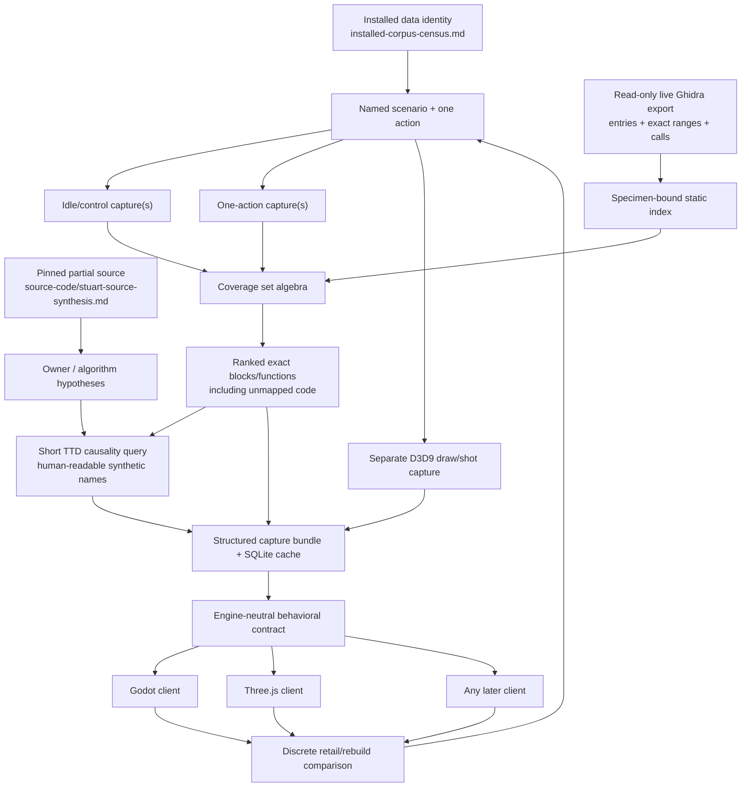

# BEA's parity lab now turns unknown runtime code into a finite, evidence-ranked function queue

Status: active — differential `drcov`, TTD Replay coverage and target-filtered
call context, exact Ghidra-range mapping, synthetic debugger symbols, structured
capture bundles, calibrated Stuart/BSim matching, an authored Mission logger,
and verified campaign ratchets are implemented; corpus-wide semantic joins,
repeated action campaigns, and rebuild-ready semantic promotion remain open

Last updated: 2026-08-14 (Gen26 authority; Gen10/Gen73 remain non-current)

Verdict: Battle Engine Aquila no longer needs to be approached as 8,124 isolated
decompiler functions plus an unbounded dark tail. A specimen-bound pipeline can
now ask one controlled
question, reduce the answer to exact executed basic-block starts or instruction
bytes, join them to exact Ghidra body fragments and direct-call context, make the
same names usable in TTD, ask the surviving Stuart source for calibrated
structural candidates, and retain CPU, D3D9, shot, and query evidence in a
machine-searchable bundle. The first safe-copy idle-versus-DOWN `drcov` canary
reduced 16,794 action-run BEA block starts to 57 action-only starts in eight
leading functions. A one-pass Replay collector subsequently mined a 693,973,901
instruction trace in 4.737 seconds and an exact two-window differential mapped
all 21,781 action-only bytes. The first BSim pilot recovered all 15 known retail
controls within rank seven. These are successful pipeline calibrations, not yet
repeatable behavioral conclusions and never automatic naming authority.

Evidence: INFERRED — the implemented tools, `drcov`, synthetic-symbol, TTD
Replay, BSim-control, capture-bundle, and bounded apitrace measurements below are
MEASURED; Stuart ownership is SOURCE-backed; manual TTD gating, WPR/GPUView,
campaign-scale recurrence, and whole-game closure remain proposed or UNKNOWN.
The weakest load-bearing claim is the projected closure system, so this document
is graded INFERRED and partitions each evidence class in the body.

Specimen: static Ghidra baseline
`local-lab/safe-copy-bea-pristine/BEA.exe.original.backup`, SHA-256
`74154BFAE14DDC8ECB87A0766F5BC381C7B7F1AB334ED7A753040EDA1E1E7750`,
2,506,752 bytes; runtime canary target
`local-lab/safe-copy-bea-pristine/BEA.exe`, SHA-256
`E1436EF7E0AD9CCBDDD43AAACA952F6E84D4B1A282835CEAD745EFCFC32FADF4`,
2,506,752 bytes. Both are copied targets. The installed Steam directory and
original executable were not mutated. The maintainer Ghidra project now contains
two authorized, recoverably backed-up promotions totaling 529 exact function
boundaries (515 plus 14); their separate-process POST readbacks are recorded
below. Those mutations assigned no semantic names, signatures, contracts, or
rebuild status.

“Baseline” here means the repository-designated unpatched retail specimen. It
is pristine only relative to the project's patch catalog; this research does
not establish its Steam depot identity.

---

## Current complete-RE replay authority (2026-08-14) — read first

Current authority is **not** the Gen10 block below or candidate Gen73. Re-read
`developer_state.json` → `current_re_authority`. Canonical Gen26 has
functions=**8,304**, C1=**217**, C2=**10**, function semantic
OPAQUE=**8,077**, contract C0_OPAQUE=**14,221**, OPEN residual=**149**
(145 dark plus four executed), complete_RE=**false**, and REBUILD_READY=**0**.
Its READY is `83403490…452a`; frozen reducer `8b86f5b5…2587`. Generation 73 is a
projection oracle only. Gen20 bounds ten retained `CExplosion` carrier calls;
Gen21 bounds strict-`CRound` slot-66 call/return placement; Gen22 bounds
strict-`CRound` slot-0 arm routing; Gen23 adds exact receiver-write pairs for
five selected arms while preserving rejected controls and lane-specific gaps.
Gen24 carried those claims exactly onto its sealed db.18613 geometry.
Generation 25 re-grounded the five repaired bodies on db.18614. Generation 26
then re-grounds the 24 JPEG/IJG structural functions on db.18615, accounts for
all **27,025/27,025** eligible carry rows, retires eight changed lineages
explicitly, and carries the new functions as DARK/FUN/OPAQUE. No semantic grade
moves.
External effects, event 4002, field meanings, broader populations, source
spelling, and direct rebuild parity remain open. The next valid campaign
generation is 27. The separate 8,136-row static-envelope closure, 34-row
MissionScript addendum, 31 text-gap classifications, and 79 ungraded external-
table rows remain distinct static evidence. C1 is not C2 runtime proof or
parity, and bounded C2 is not rebuild-ready.

## Historical recursive-campaign snapshot (2026-08-04, Generation 10)

- Generation 10 was the machine-local range/contract admission then: 8,124 functions,
  6,117 residuals, 162,017 unmapped executable bytes, 14,241 contracts, and 584
  exact supersessions. At that handoff four contracts were `C2_BOUNDED_RUNTIME`
   (canonical Gen19 retains those **four**, adds the separately re-proved
   zero-shield ApplyDamage path as a fifth, and the bounded SetPos position-copy
   path as a sixth, and LockHit's single-node removal path as a seventh). None is rebuild-ready. Gen18 adds static TokenArchive C1 and Gen19 adds static UnsetObjective C1 without runtime closure. Generation 9's five target-lock
  changes remain same-range metadata/evidence corrections; Generation 10
  separately admitted three bounded Level 521 call-context contracts.
- A replicated disposable bridge redirected only the four `ShowCmds`/`ShowVars`
  output calls into the already proved file logger. Two A/B replications yielded
  byte-identical treatment logs and recovered 31 commands plus 56 variables on
  Level 100. Static registration has 32/59; `fmv_play` and three debris variables
  were not realized on that path.
- The retired residual `[0x004295BC,0x00429BC0)` now has a proved and live-read-back
  exact partition: 14 opaque function bodies / 1,433 code bytes plus 15 terminal
  NOP-padding ranges / 107 bytes. The campaign deliberately leaves callback
  names, signatures, behavior, and rebuild ownership open.
- The trace corpus is 75 traces / 497.31 GiB. Coverage exists for 73 traces, yet
  65 are still coverage-only. The target-filtered Replay collector is now
  calibrated twice against exact `1/1/2/0` controls: four call-entry pairs,
  four raw returns, three validated returns, one orphan, three gap-free
  envelopes, and successful adverse controls. Registers and stack bytes remain
  untyped; corpus-scale semantic joining remains open.

These are instrument and accounting gains. They shorten the path to contracts
and reconstruction, but do not themselves prove callback semantics or gameplay
parity.

## What this document is

This is the engine-neutral parity and function-discovery plan requested after
the four master research passes:

- [`installed-corpus-census.md`](installed-corpus-census.md) owns the installed data/resource topology and the
  finite authored scenario space.
- [`ghidra-functions.md`](ghidra-functions.md) owns the executable, current
  function population, analyst metadata, runtime evidence, and naming debt. The
  filename's missing `I` is historical and intentional.
- [`source-code/stuart-source-synthesis.md`](source-code/stuart-source-synthesis.md) owns the pinned GPL source's
  architecture, surviving implementation, target selection, omissions, and
  source-to-retail deltas.
- [`delta.md`](delta.md) owns the cross-source adjudication and current rebuild
  gaps.

Those files are combined here wherever they answer the same question. Their
provenance is not erased: agreement is stronger than either source alone, while
a disagreement is often the most valuable result. A Ghidra name is analyst
metadata, Stuart is partial source from an uncertain production lineage, a
capture is one observed runtime path, and rebuild code is present
reconstruction behavior. Treating those four things as interchangeable would
make the resulting document simpler but false.

This document has four jobs:

1. Record exactly what has already been implemented and measured.
2. Define the smallest loop that turns a gameplay action into a reviewable
   unknown-function queue.
3. Make every remaining denominator, acceptance gate, and failure state
   countable.
4. Keep the resulting behavioral contracts independent of Godot, Three.js, or
   any later renderer/client choice.

It does **not** promise that coverage alone can recover every original developer
name. It makes the larger problem tractable by combining complementary oracles
and by refusing to promote a plausible label without evidence.

## Executive result

The best first experiment from the brief has been performed:

> Record “idle” and “do one action,” diff the executed code, and map the result
> back to Ghidra.

The experiment used DynamoRIO 11.3.0's 32-bit text `drcov` client against a
copied BEA target. One run remained idle for 25 seconds. A second run posted one
target-window `DOWN` tap at +15 seconds. The game executable's hash was checked
before and after both runs, no app-local `d3d9.dll` was present, the launched
process was owned by the wrapper, and the original install was outside the
allowed target set.

The result was:

| Measure | Idle | DOWN action | Differential interpretation |
| --- | ---: | ---: | --- |
| Unique BEA basic-block starts | 16,741 | 16,794 | Presence, not dynamic hit count |
| Stable action-only starts | — | 57 | In action and absent from idle |
| Exact Ghidra mappings for those 57 | — | 57 | Accounting closed; zero silently dropped |
| Leading functions containing those starts | — | 8 | Four action-only functions, four shared functions with action-only branches |
| Literal `FUN_*` among those eight | — | 0 | This action exercised an already named input/frontend path |
| Literal `FUN_*` observed anywhere in either run | 262 across union | 262 across union | Observation only; not action-specific |
| Action delivery canary | 0/1 | 1/1 | `CFrontEnd__ReceiveButtonAction @ 0x004669A0` |
| Capture health | `COMPLETE` | `COMPLETE` | Inputs parsed and artifact checks closed |
| Comparability | \- | `CORRELATED` | Only one pair; not enough for stable behavior |
| Hypothesis verdict | \- | `UNKNOWN` | No causal function claim was made |

The eight leading functions, in deterministic queue order, were:

| Rank | Entry | Current Ghidra name | Class | Idle/action support | Action-only block starts |
| ---: | --- | --- | --- | --- | ---: |
| 1 | `0x0042E4D0` | `CController__SendButtonAction` | action-only function | 0/1, 1/1 | 17 |
| 2 | `0x004669A0` | `CFrontEnd__ReceiveButtonAction` | action-only function | 0/1, 1/1 | 10 |
| 3 | `0x0042A4F0` | `CConsole__ExecuteBufferedCommandSlot` | action-only function | 0/1, 1/1 | 5 |
| 4 | `0x0051B660` | `CFEPMultiplayerStart__SubObj4034__ButtonPressed` | action-only function | 0/1, 1/1 | 2 |
| 5 | `0x00512E40` | `PCLTShell__VFunc_12_00512e40` | shared function, novel branch | 1/1, 1/1 | 9 |
| 6 | `0x0042DB40` | `CController__DoMappings` | shared function, novel branch | 1/1, 1/1 | 8 |
| 7 | `0x00513A90` | `PlatformInput__GetKeyOnceCore` | shared function, novel branch | 1/1, 1/1 | 5 |
| 8 | `0x0056D647` | `CRT__ConvertLongDoubleToDecimalRecordCore` | shared function, novel branch | 1/1, 1/1 | 1 |

This is exactly what a first canary should do. It found the input dispatch chain,
proved that the action was observed inside BEA rather than merely posted by the
wrapper, retained an odd frontend subobject result that deserves examination,
and did not manufacture a new function identity merely because a block was
different.

The authoritative ignored-local output is:

```text
local-lab/parity-lab-canary-down-diff-v4-2026-07-29/
    manifest.json
    report.md
    coverage.sqlite
    blocks.jsonl
    delta-blocks.jsonl
    functions.jsonl
```

`manifest.json` has SHA-256
`96BCA1DC0E23889F077A36328EBF23883D0729408F05B90F6A0CE47FDD0B3A97`.
The verifier rehashed 13 authoritative inputs/outputs and returned no problems.

## Implemented, proved, and still proposed

The distinction in this table is load-bearing. “Implemented” means repository
code exists. “Proved” means a real local artifact or controlled target exercised
it. “Proposed” means the design is specific enough to build but has not passed
its acceptance gate.

| Capability | Implementation | Real proof | Present verdict |
| --- | --- | --- | --- |
| Exact Ghidra function-body fragments | [`tools/ExportParityLabGraph.java`](../tools/ExportParityLabGraph.java) | 7,555 functions / 7,672 ranges exported read-only | `MEASURED` |
| Static internal direct-call graph | same exporter | 14,142 edges / 26,622 call sites | `MEASURED`, statically resolved calls only |
| Safe copied-target `drcov` recording | [`tools/Record-DifferentialCoverage.ps1`](../tools/Record-DifferentialCoverage.ps1) | one 25 s idle and one 25 s DOWN capture | `MEASURED`, one pair |
| Repeated differential coverage and exact mapping | [`tools/parity_lab.py`](../tools/parity_lab.py) | 57/57 stable novel starts mapped | `MEASURED`, canary only |
| Mechanical action-delivery canaries | `coverage-diff --action-canary` | `0x004669A0`: action 1/1, idle 0/1 | `MEASURED` |
| Ghidra-to-TTD symbol map | `parity_lab.py symbol-map` | 7,672 exact fragment symbols generated | `MEASURED` |
| WinDbg/CDB synthetic-symbol extension | [`tools/bea_ttd_symbols.cpp`](../tools/bea_ttd_symbols.cpp) | CDB canary plus TTD symbolic/numeric `Calls` agreement | `MEASURED` |
| Reproducible extension build | [`tools/Build-BeaTtdSymbols.ps1`](../tools/Build-BeaTtdSymbols.ps1) | two `/Brepro` builds had identical DLL SHA-256 | `MEASURED` |
| Structured D3D9/TTD/shot bundle | `parity_lab.py capture-bundle` | real Level 100 B2 capture indexed losslessly | `MEASURED` |
| Read-only query and artifact verification | `parity_lab.py query/verify` | real 74 MiB SQLite index; 246 artifacts rehashed | `MEASURED` |
| One-pass TTD Replay-API coverage miner | [`tools/ttd-exec-coverage/ttd_exec_coverage.cpp`](../tools/ttd-exec-coverage/ttd_exec_coverage.cpp), build/invoke wrappers, and `ttd-coverage-diff` | 693,973,901-instruction whole trace plus exact two-window differential | `MEASURED`; one existing trace, presence not frequency |
| Target-filtered TTD call-context miner | same native collector plus [`tools/Invoke-TtdCallContext.ps1`](../tools/Invoke-TtdCallContext.ps1) | schema-v3 calibration: 4 paired entries, 4 raw returns, 3 validated returns, 1 orphan, 3 gap-free envelopes; replicated Level 521 bounded join | `MEASURED`; raw untyped context, existing traces only, no semantic auto-promotion |
| TTD Replay bundle/query integration | `capture-bundle --ttd-coverage/--ttd-coverage-receipt` | 2,612 ranges, assertions, gaps, and receipts indexed and reverified | `MEASURED` |
| Stuart-source BSim candidate oracle | [`tools/Build-StuartBsimPilot.ps1`](../tools/Build-StuartBsimPilot.ps1) and [`tools/ExportBSimCandidates.java`](../tools/ExportBSimCandidates.java) | 8 reproducible COFF objects, 58 BSim functions, 15/15 controls within rank seven | `MEASURED` candidate calibration; never an auto-renamer |
| apitrace D3D9 trial | [`tools/Record-ApitraceD3D9.ps1`](../tools/Record-ApitraceD3D9.ps1) | 466 complete presents recovered from one forced-end startup capture and replayed cleanly | `MEASURED` feasibility; translated inspection only |
| WPR/WPA/GPUView timing lane | existing Microsoft tools | binaries present; no elevated recording run here | `AVAILABLE`, not exercised |
| TTD manual record gating | official thread-local API design | no local end-to-end target instrumentation | `EXPERIMENTAL` |
| RenderDoc-through-DXVK | exploratory only | no parity authority | `NON-AUTHORITATIVE` |

## The actual closure gap

The current layers must remain separate:

| Population | Current count | Meaning |
| --- | ---: | --- |
| Saved Ghidra function entries | 8,304 | Exact 2026-08-14 live/tracked readback; includes the 34 registry-callable, 31 text-gap, 79 external-table, and 24 JPEG/IJG boundaries |
| Reviewed 79-row structural cohort still outside Ghidra | 0 | The external-table cohort completed its separate backed live admission |
| Defensible saved census/lower bound | **8,304** | Not a final ceiling |
| MSVC exception/unwind funclets in saved Ghidra | 1,179 | Compiler machinery; not gameplay-semantic closure |
| Literal `FUN_<address>` names in saved Ghidra | 1,012 | The separate 34-row new-function vocabulary ceremony replaced those defaults; the 31 text-gap, 79 external-table, and 24 JPEG/IJG structural rows retain default names |
| Static-envelope accounting | 8,170 rows: 8,163 C1 + 7 C2 | Dated 8,136-row table plus reviewed 34-row addendum; excludes the 31 text-gap, 79 external-table, and 24 JPEG/IJG rows |
| Canonical campaign | 8,304 rows: 217 C1 + 10 C2 + 8,077 OPAQUE | Gen26 db.18615 authority; 27,025/27,025 eligible carry rows accounted for |
| Canonical residual ledger | 6,144 rows: 145 open dark + 4 open executed + 899 terminal bounded ambiguity + 30 terminal data + 5,066 terminal padding | The 149 open rows describe sealed Generation-26 geometry, not semantic regression |
| Canonical rebuild states | 14,439 NOT_READY + 8 PARTIAL_CONTRACT + 1 CONTRACT_ONLY + 0 REBUILD_READY | Contract mapping state, not implementation parity |
| Mission native registry | 144 unique names / 144 unique handlers | Finite shipped registry |
| Registry handlers already modeled in Ghidra | 144 | 110 pre-existing plus 34 separately promoted callable entries |
| Registry handlers awaiting Ghidra boundary creation | 0 | Tier-2 registry names are complete; signatures and runtime semantics remain separate gates |

The saved-name projection is
`reverse-engineering/binary-analysis/ghidra-function-name-table-2026-08-13.tsv`
(8,304 rows; SHA-256 `5dd0d114…dfbc`). The independent Mission-registry
missing-boundary proof
is under `local-lab/mission-registry-missing-functions-20260813-v1/` and
reproduces byte-identically. Older 7,555-row and 86-missing figures below are
historical measurements only, not current planning denominators.

This correction illustrates why the pipeline binds every result to an inventory
hash. A queue generated against one inventory cannot silently become current.

The important conclusion is that “rename every `FUN_*` function” remains too
narrow: 1,012 current defaults are only a naming state, and thousands of
descriptive or hypothesis names still require evidence appropriate to their
claim. The Mission cohort kept boundary creation separate from both the 75-row
existing-entry and 34-row new-entry Tier-2 normalizations so structural
discovery could not silently become semantic naming.

The parity lab therefore ranks literal `FUN_*`, provisional vfuncs, invented
owners, conflicts, ambiguous owners, post-fullpass entries, and executed bytes
outside any current function. The goal is **semantic closure**, not cosmetic
removal of a prefix.

## Why the installed data corpus belongs in a function-discovery system

[`installed-corpus-census.md`](installed-corpus-census.md) measured 5,515 installed files, 133 directories,
and 702,659,189 logical bytes. `data` owns 5,464 files and 692,713,321 bytes.
That corpus is not just asset inventory; it supplies finite scenario inputs and
authored names that make dynamic function discovery cheaper:

| Installed owner | Measured finite surface | Function-discovery use |
| --- | ---: | --- |
| Mission scripts | 733 nonempty `.msl` files; 36,735 nonblank lines | Select actions/entities and rank native handlers by authored use |
| Mission VM | 144 native rows, 27 opcodes, 6 datatypes | Turn an open-ended VM problem into bounded registry campaigns |
| AYA wrappers | 1,361 files / 1,725 zlib members | Choose resource-family load/decode scenarios and detect untested families |
| Numeric worlds | 97 headers, 95 script directories, 66 resource archives | Build an explicit world coverage matrix rather than “play some levels” |
| Definition/factory layer | 26 selectors; 33 creations in the Level 100 trace | Pair authored record identity with constructor/factory execution |
| Mesh AYA | 213 files; 5,494 bounded observed chunks | Drive loader/renderer scenarios by chunk and feature family |
| Texture AYA | 47 resources plus 800 DXTn-named files | Join runtime texture identity to exact local resource candidates |
| Sound/message audio | 3,053 files under `data\sounds` | Select language, message, bank, and playback scenarios |
| Video | 66 files / 353,110,648 bytes | Isolate Bink/startup/cutscene owners from gameplay rendering |
| Save/options envelope | eleven 10,004-byte files | Drive load/save/options paths from real baselines while preserving unknowns |

The full installed-file manifest is not itself shipped into a capture bundle.
Instead, a scenario records the smallest relevant file identities and hashes.
For example, “spawn Target Tank in Level 100” should bind the exact loose/packed
mission inputs, definition identity, runtime target hash, trace/capture receipt,
and resulting function queue. That lets an agent ask which executable functions
were unique to one authored entity without mistaking repeated localized audio
or duplicate assets for independent engine behavior.

## Evidence and identity model

Every parity-lab claim is keyed by five identities.

### 1. Binary specimen

The minimum executable key is:

```text
SHA-256
byte length
PE machine
PE timestamp
PE checksum
preferred image base
SizeOfImage
```

For the current specimens:

| Field | Static Ghidra baseline | Runtime canary target |
| --- | --- | --- |
| SHA-256 | `74154BFA…E7750` | `E1436EF7…ADF4` |
| MD5 | `3b456964020070efe696d2cc09464a55` | `9a0c8339bcb0d2ad954583285d1a432e` |
| Bytes | 2,506,752 | 2,506,752 |
| Machine | `0x014C` | `0x014C` |
| Timestamp | `0x3ED21313` | `0x3ED21313` |
| Checksum | `0x00000000` | `0x00000000` |
| Preferred base | `0x00400000` | `0x00400000` |
| SizeOfImage | `0x005D8000` | `0x005D8000` |

The two files are layout-compatible but not byte-identical. The implemented
derivation check measured one four-byte file range:

```text
file offsets [0x0012A644, 0x0012A648)
static bytes  A1 F0 2D 66
runtime bytes B8 01 00 00
```

`image_derivation` now accepts only byte-identical inputs or this exact
static-SHA/runtime-SHA/range/byte allowlist
(`bea-pristine-to-reviewed-safe-runtime-v1`). A same-layout executable with even
one other changed byte fails closed. Every result retains the reviewed delta; a
reviewer must flag any function or executed block intersecting the patch before
source/static/runtime behavior is compared. This safe-copy target is also
distinct from the current installed Steam executable catalogued in
`installed-corpus-census.md`, whose documented hash and patch set are different.

### 2. Canonical address

The cross-tool key is a relative virtual address:

```text
runtime RVA = guest VA - actual TTD/drcov module base
Ghidra RVA  = Ghidra address - 0x00400000
```

Raw virtual addresses are retained for readability, but no cross-run join is
performed on a raw VA alone. The module identity must pass first. This makes the
pipeline safe if a future capture relocates the image.

### 3. Function identity

A function key is:

```text
inventory SHA-256
entry RVA
ordered exact body fragments
per-fragment bytes and SHA-256
current name, source, tags, and naming-risk class
```

A min/max envelope is not a function body. The current database contains 67
fragmented functions and one function has 21 disjoint ranges. Coverage in a gap
must not be assigned to the surrounding function.

### 4. Capture/run identity

Each `drcov` log requires a distinct receipt with:

```text
schema and run ID
baseline/action role
exact log path, hash, and byte count
target path and SHA-256
tool and version
working directory and arguments
capture start/end facts
action protocol and status
completion/termination facts
```

Copied-identical logs, duplicate run IDs, wrong paths, missing receipts, target
mismatches, and incomplete captures are refused or remain unscored.

### 5. Claim state

Four independent fields prevent “a parser succeeded” from becoming “the game
matches”:

| Field | Values | Question |
| --- | --- | --- |
| Capture health | `COMPLETE`, `PARTIAL`, `ERROR` | Were all claimed inputs captured and parsed? |
| Instrument acceptance | `true`, `false` | Did explicit marker/negative-control checks pass? |
| Comparability | `COMPARABLE`, `CORRELATED`, `UNSCORED` | Are the observations valid controls for one another? |
| Hypothesis verdict | `PASS`, `FAIL`, `UNKNOWN` | Did the named discrete claim close? |

A complete standalone D3D9 log is still `UNSCORED` for parity if it has no
matched control. A TTD replay can be capture-health `COMPLETE` while a failed
known-answer marker makes acceptance false and comparability `UNSCORED`.
Free-text “positive control” prose never upgrades these fields.

## Engine-neutral architecture



The arrows do not imply that TTD and the D3D9 proxy are timestamp-joined. The
current safety wrappers deliberately keep those observers in separate runs, and
TTD substantially distorts time. They are sibling observations of one named
scenario until a shared event identity is measured.

## Implemented static layer: exact Ghidra ranges and direct calls

Evidence: **MEASURED** from a read-only headless export of the current
maintainer project.

The previous inventory was enough to count and name functions but not enough to
perform exact coverage attribution. Its `bodyMin`, `bodyMax`, and `bodyRanges`
fields could describe a bounding envelope containing bytes Ghidra did not assign
to the function. [`tools/ExportParityLabGraph.java`](../tools/ExportParityLabGraph.java)
closes that gap.

For every current function it emits one TSV row per actual Ghidra
`AddressRange`:

```text
functionAddress
functionName
rangeOrdinal
rangeMin
rangeMax                 # Ghidra-inclusive
rangeEndExclusive        # normalized half-open endpoint
rangeBytes
rangeSha256              # hash of the bytes Ghidra exposes for this exact range
```

The file header binds the output to:

```text
schema=bea-ghidra-parity-graph.v2
executableMd5=3b456964020070efe696d2cc09464a55
executablePath=<Ghidra import metadata>
imageBase=0x00400000
language=x86:LE:32:default
compilerSpec=windows
```

The parser rejects:

- a missing executable MD5;
- a Ghidra/static MD5 mismatch;
- a different image base;
- a range whose owner is absent from the inventory;
- a missing function entry;
- overlapping ranges;
- an entry outside all of its ranges;
- a range-count or byte-total disagreement;
- an inverted/empty range;
- an envelope/range inconsistency.

Unscorable inventory envelopes are excluded from the interval index rather than
allowed to contaminate a neighboring exact function.

The two TSVs are not independently valid files. The exporter writes both to
`CREATE_NEW` sibling temporaries, hashes them, publishes the two final names as
no-clobber hard links, and publishes `parity-graph.ready.json` last. Consumers
require that READY receipt and verify its schema, shared directory, filenames,
sizes, hashes, program tuple, function/range counts, and edge/call-site counts.
A crash between the two data links leaves no READY marker and therefore no
admissible graph. A forced rerun against existing v5 outputs emitted no
`PARITY_GRAPH_OK` marker, reported the no-clobber refusal, and changed zero
files. Ghidra headless returned process exit `0` for that script exception, so
the success marker and verified receipt—not `$LASTEXITCODE`—are the gate.

The same script scans each function body's instructions and records internal
call flows for which Ghidra resolves a concrete function entry. Multiple
instructions from one caller to one callee are aggregated into
`callSiteCount`. External functions, unresolved computed calls, vtable calls,
and indirect function-pointer dispatches are absent by construction. The edge
kind is therefore named `STATIC_DIRECT`, not “all calls.”

The final 2026-07-29 v5 export measured:

| Output | Rows/facts | Bytes | SHA-256 |
| --- | ---: | ---: | --- |
| `body-ranges.tsv` | 7,555 functions, 7,672 exact ranges | 1,105,130 | `5AB0BDBEF7B8B0F38AE77A98D065D32A9D8236F25D2CBB6817E6D8154477CD77` |
| `direct-calls.tsv` | 14,142 internal edges, 26,622 call sites | 1,361,532 | `8186FAEC61ED62128458346F4125BD76C6D64B794BFD95B50AE8C3B71387B865` |
| `parity-graph.ready.json` | hash/program/count binding for both TSVs | 767 | `F826FE1C92BE02054831EF88132D424586667C7B9575AAC872488503FAAFD6A2` |

The earlier v4 pair remains historical pre-receipt evidence. The final
receipt-gated ignored-local directory is:

```text
local-lab/parity-lab-static-v5-2026-07-29/
```

Reproduction command:

```powershell
$headless = 'D:\ghidra_12.1.2_PUBLIC_20260605\ghidra_12.1.2_PUBLIC\support\analyzeHeadless.bat'
& $headless `
  'C:\Users\david\Ghidra\Projects' 'BEA' `
  -process 'BEA.exe' `
  -readOnly -noanalysis `
  -scriptPath (Resolve-Path .\tools).Path `
  -postScript ExportParityLabGraph.java `
  '<ignored-output>\body-ranges.tsv' `
  '<ignored-output>\direct-calls.tsv' `
  '<ignored-output>\parity-graph.ready.json'
```

The `-readOnly` and `-noanalysis` flags are required. Exporting evidence is
authorized by this workflow; applying names, comments, signatures, types, or
new functions to the maintainer project remains a separate reviewed mutation.

## Implemented dynamic layer: safe differential `drcov`

Evidence: **MEASURED** from the two safe-copy runs described below and from
thirteen focused tool tests.

### Recorder boundary

[`tools/Record-DifferentialCoverage.ps1`](../tools/Record-DifferentialCoverage.ps1)
is deliberately a small launcher, not a debugger:

1. Require a baseline/action role and a filesystem-safe unique run name.
2. Resolve the target and 32-bit `drrun.exe` to absolute paths.
3. Refuse `steamapps`, Program Files, or a missing target.
4. Require the caller's exact expected SHA-256.
5. Refuse an app-local `d3d9.dll`; CPU and graphics observers remain separate.
6. Refuse to start while any other `BEA` process exists.
7. Create a fresh output directory; never overwrite a prior capture.
8. Start `drrun -t drcov -dump_text` in the copied game's working directory.
9. For action runs, wait the requested delay and use only bounded
   target-window messages through the repository input helper.
10. Close only the process started by the wrapper.
11. Wait for DynamoRIO to finalize its log.
12. Hash the target again and fail if it changed.
13. Write an explicit success/failure receipt.

The wrapper does not claim that `PostMessage` means the game processed the
action. Every schema-v1 action receipt is
`POSTED_NOT_ACKNOWLEDGED`; there is no caller-selectable status and the importer
never treats a legacy caller label as verification. `coverage-diff` upgrades
action delivery only from a mechanical `--action-canary`. A future separately
structured observed-receipt schema could become another route, but none is
implemented now.

The DynamoRIO specimen used here was the official 11.3.0 Windows release at:

```text
G:\bea-parity-lab\tools\
  DynamoRIO-Windows-11.3.0\
  DynamoRIO-Windows-11.3.0-1\bin32\drrun.exe
```

The downloaded archive's SHA-256 was
`5516B8B4C929885DC4172E088ED11EA5DB967F80ED739A3E7925FE2CDD798C6D`.

### Coverage semantics

Text `drcov` records basic-block instances by module offset and size. In this
pipeline:

- one RVA in a run is one observed basic-block **start**;
- duplicate rows collapse within that run;
- recurrence is the number of distinct receipts/runs containing the start;
- recurrence is **not** a dynamic execution count;
- a hit proves observation;
- a miss proves only non-observation in the recorded interval;
- block-start set algebra does not claim every byte in a block executed on every
  visit.

The parser supports the measured v3 module-table format, including its bare
hexadecimal segment offset. It validates the selected module path, preferred
base, timestamp, log hash, receipt link, target hash, unique run ID, and
cross-run basic-block size consistency.

### Repeated-run set algebra

For baseline runs \(B_1 \ldots B_n\) and action runs \(A_1 \ldots A_m\):

```text
baseline union       B = B1 ∪ B2 ∪ ... ∪ Bn
action union         U = A1 ∪ A2 ∪ ... ∪ Am
stable action set    A = A1 ∩ A2 ∩ ... ∩ Am
any novel starts         U - B
stable novel starts      A - B
```

This definition is intentionally conservative. A block becomes “stable novel”
only if every action run contains it and no baseline run contains it. Per-run
support is retained so an analyst can see unstable or action-enriched paths
instead of losing them.

For each executed start, exact interval lookup returns one of:

```text
EXACT_GHIDRA_RANGES
EXACT_CONTIGUOUS_INVENTORY
AMBIGUOUS_OVERLAP
UNMAPPED
```

Every novel start is written to `coverage_delta_block` and
`delta-blocks.jsonl`, including ambiguous and unmapped starts. The invariant is:

```text
exactly mapped + ambiguous + unmapped = all stable novel starts
```

Missing-function candidates are therefore first-class output rather than
discarded because no current function owns them.

### Function classifications and queue order

An observed function receives exactly one class:

1. `ACTION_ONLY_STABLE_FUNCTION`
2. `SHARED_WITH_STABLE_ACTION_BLOCKS`
3. `ACTION_ONLY_UNSTABLE_FUNCTION`
4. `ACTION_ENRICHED_RECURRENCE`
5. `SHARED_WITH_UNSTABLE_ACTION_BLOCKS`
6. `UNSCORED_MAPPING`
7. `SHARED_OR_NO_OBSERVED_DELTA`

Within a class, literal `FUN_*` names rank first, then stable novel-block count,
any novel-block count, action support, and entry address. Static direct callers
and callees accompany every candidate. The ordering is deterministic; it is a
triage order, not a probability of identity.

### Mechanical action canaries

An `--action-canary` is a Ghidra entry required in every action run and absent
from every baseline run. Multiple canaries may be supplied.

The canary answers only:

> Did the expected in-game action path execute differentially?

It does not prove that every action-only function caused the visible behavior.
For the real DOWN experiment:

```text
CFrontEnd__ReceiveButtonAction @ 0x004669A0
idle support   0/1
action support 1/1
result         passed
```

That upgraded delivery from posted-only to `COVERAGE_CANARY`. Comparability
remained `CORRELATED`, because a single pair cannot establish recurrence.

### Exact first-run receipts

Baseline:

```text
run ID       canary-idle-20260729-01
protocol     no input; 25 seconds
log bytes    11,943,248
log SHA-256  97B4D084F449D3CE78BA5CC942D1A897D2EB7FF6EA2D2AE9AB0BF443CF375D02
target       E1436EF7…ADF4 before and after
termination  owned process; no forced termination
```

Action:

```text
run ID       canary-down-20260729-03
protocol     at +15 seconds, target-window tap:DOWN
log bytes    11,860,929
log SHA-256  DF3040C0344B86C0D84C36BD999F912DE9C3EB435C18D419E8791F9BC76ADEB1
target       E1436EF7…ADF4 before and after
termination  owned process; no forced termination
receipt      POSTED_NOT_ACKNOWLEDGED
import       upgraded by coverage canary
```

Two earlier action attempts remain in ignored local storage as honest failed
experiments:

- `canary-down-20260729-01` exposed a finalization/cleanup failure path.
- `canary-down-20260729-02` exposed that the input helper required the explicit
  target window handle.

The wrapper was corrected after each failure; neither failed directory was
relabelled or silently reused.

### Reproduction commands

Record an idle control:

```powershell
pwsh -NoProfile -File .\tools\Record-DifferentialCoverage.ps1 `
  -Name '<unique-idle-run>' `
  -Role baseline `
  -TargetExe 'C:\path\to\copied\BEA.exe' `
  -ExpectedTargetSha256 'E1436EF7E0AD9CCBDDD43AAACA952F6E84D4B1A282835CEAD745EFCFC32FADF4' `
  -CaptureSeconds 25
```

Record one action:

```powershell
pwsh -NoProfile -File .\tools\Record-DifferentialCoverage.ps1 `
  -Name '<unique-action-run>' `
  -Role action `
  -TargetExe 'C:\path\to\copied\BEA.exe' `
  -ExpectedTargetSha256 'E1436EF7E0AD9CCBDDD43AAACA952F6E84D4B1A282835CEAD745EFCFC32FADF4' `
  -CaptureSeconds 25 `
  -ActionDelaySeconds 15 `
  -ActionSequence 'tap:DOWN'
```

Build a repeated diff:

```powershell
py -3 .\tools\parity_lab.py coverage-diff `
  --baseline '<idle-1.log>' --baseline-receipt '<idle-1-receipt.json>' `
  --baseline '<idle-2.log>' --baseline-receipt '<idle-2-receipt.json>' `
  --baseline '<idle-3.log>' --baseline-receipt '<idle-3-receipt.json>' `
  --action '<action-1.log>' --action-receipt '<action-1-receipt.json>' `
  --action '<action-2.log>' --action-receipt '<action-2-receipt.json>' `
  --action '<action-3.log>' --action-receipt '<action-3-receipt.json>' `
  --ghidra '<current-function-inventory.tsv>' `
  --body-ranges '<exact-body-ranges.tsv>' `
  --call-edges '<direct-calls.tsv>' `
  --graph-receipt '<parity-graph.ready.json>' `
  --static-exe '.\local-lab\safe-copy-bea-pristine\BEA.exe.original.backup' `
  --target-exe '.\local-lab\safe-copy-bea-pristine\BEA.exe' `
  --scenario '<one-bounded-action>' `
  --question '<one falsifiable question>' `
  --action-canary '<known action entry>' `
  --out '<fresh ignored output directory>'
```

The preferred minimum is three paired repetitions. Pair order should alternate
(`idle/action`, then `action/idle`) where the workflow permits it so monotonic
startup/warm-cache drift is not perfectly confounded with role.

## Implemented TTD symbol bridge

Evidence: **MEASURED** from a session-local CDB symbol canary and a real
34,359,738,368-byte Level 100 TTD trace.

### Exact map generation

`parity_lab.py symbol-map` converts the frozen inventory and exact body ranges
to RVA symbols. It validates the same static/runtime derivation used by
coverage, then emits one symbol per exact fragment:

```text
rva
size
name
rangeAddress
functionAddress
originalName
rangeOrdinal
rangeRole
rangeQuality
```

Names retain provenance and risk:

```text
gh_HUMAN_LABEL_CGenericActiveReader_SetReader_RVA_001000
gh_LITERAL_FUN_FUN_004010c0_RVA_0010C0
gh_GENERIC_OR_SHARED_SharedVFunc_ReturnColorFF000080_004013f0_RVA_0013F0
```

The map header binds the function inventory, exact-range sidecar, Ghidra MD5,
static SHA-256, runtime SHA-256, image base, and measured four-byte derivation.
Fragment aliases never use a min/max envelope.

The final deterministic v5 map contains:

```text
7,672 exact-range symbols
7,555 owning functions
67 fragmented functions
1,150,500 bytes
SHA-256 3FC189E25CA369D8C60A5FC21B8D4CD1BF155931F5850827764447B9667F2D48
```

Three separately named outputs were byte-identical. The generator omits
volatile timestamps, reserves the tail of every at-most-220-character symbol
for the owning/fragment RVA identity, asserts global name uniqueness, rejects a
range that crosses `SizeOfImage`, rechecks its inventory/range inputs after
parsing, and publishes through a sibling temporary plus a no-clobber hard link.
Regenerate the map whenever the inventory, range sidecar, or target changes
rather than treating this hash as permanent.

### Debugger extension

[`tools/bea_ttd_symbols.cpp`](../tools/bea_ttd_symbols.cpp) is a Win32 dbgeng
extension. Its `!beasym <map.tsv> <module>` command:

1. Resolves the actual loaded module base and extent.
2. Reads the frozen RVA map.
3. Rejects malformed, zero-size, and out-of-module rows.
4. Installs the already normalized, unique names emitted by `parity_lab.py`.
5. Calls `IDebugSymbols3::AddSyntheticSymbol` with actual runtime VAs.
6. Prints exact added/rejected/malformed/out-of-module accounting.

Synthetic symbols are session-local. They neither alter `BEA.exe` nor write to
Ghidra. They disappear when the module/debugger session closes.

The build script discovers prerelease Visual Studio correctly with
`vswhere -prerelease`, targets x86 to match the current CDB harness, uses
`/W4 /WX`, directs import artifacts to `build/bea-ttd-symbols`, and uses
`/Brepro`. The current two distinct output artifacts are byte-identical:

```text
55,808 bytes
SHA-256 A0DEA279D588BAD05382D0E6CF5FA37F9C858CEFDF166925DDC2E7C644D08451
```

The proof receipt binds both paths and hashes. It does not bind two independent
compiler invocations or build roots, so it calls this
`TWO_DISTINCT_ARTIFACTS_BYTE_IDENTICAL`, not a stronger independent-build
claim.

The earlier Level 100 proof used a prior map/build pair from the same extension
lineage,
SHA-256
`DBB33AA8813B1A693C984D34866224D4B9BD170FEBA9C3BCD3F6AD4EF5A2000D`.
The proof is tied to its recorded artifacts rather than retroactively
relabeled.

### End-to-end TTD proof

The final v5 map and current DLL are now proven together against
`G:\bea-ttd\verify-cwd-fix\verify-cwd-fix.run`:

```text
trace bytes      444,596,224
trace SHA-256    14DE2F708BC7C661F63DB99173C4E0869C83DA2A88328444E4FEBA3A78C6E987
map rows         7,672 / 7,672
rejected         0
malformed        0
out of module    0
bounded retries  1
bridge verdict   PASS
```

Symbolic and numeric `TTD.Calls` counts agree for three nonzero controls:
`CCareer__Load` 1/1, `CFrameTimer__Frame` 2/2, and literal
`FUN_004010c0` 1/1. `FatalError_ExitWithLocalizedPrefix_B` is the 0/0 negative
control. The hash-verifiable receipt is
`local-lab/parity-current-symbol-proof-receipt-v2-20260729/receipt.json`;
its manifest SHA-256 is
`E12C86FBF52A98321B928C0AB7D1B5142FBC253B072D0F859D883C426340E187`.

The receipt deliberately grades capture provenance `PARTIAL`: the existing
trace's producer receipt predates capture-time trace hashing. This proof binds
the current trace bytes and recorded PE header, but cannot retroactively prove
every recorded target byte against the known-answer executable.

For historical continuity, the first extension-lineage proof was the much
larger Level 100 trace:

On `G:\bea-ttd\play-level100\play-level100.run`:

- trace size was exactly 34,359,738,368 bytes;
- the query schema was `ttd-query-result.v2`;
- the trace module's PE signature, timestamp, `SizeOfImage`, and image base all
  agreed with runtime target `E1436EF7…ADF4`;
- the impossible-module negative control passed;
- 7,554 of the then-7,555 map rows were accepted; one collision was explicitly
  rejected;
- `TTD.Calls("BEA!IScript_SpawnThing").Count()` returned `1`;
- `TTD.Calls(0x00536cd0).Count()` returned `1`.

That historical pair settled the previously undocumented question: the
installed TTD/CDB version accepts synthetic names from this extension lineage
in `TTD.Calls`, at least for the measured unfragmented `SpawnThing` symbol. It
did not certify the final v5 pair, which is why the smaller proof above was
required. Neither proof settles prototypes. Synthetic symbols do not supply
types, parameter names, or calling conventions; typed `Calls` arguments still
require PDB-quality type information or manual adjudication.

That historical query predates trace-hashed receipt/result schema v3. Its
numeric symbol result remains measured, but a fresh import now grades the
unhashed v2 artifact `PARTIAL`/`UNSCORED`; matching path and 32 GiB byte length
cannot prove immutable trace identity.

The proof took roughly fourteen minutes because opening/querying the existing
32 GiB trace is expensive. The exact-fragment map hardening was therefore
verified independently through generated-map structure and the small CDB
canary, rather than pretending the old aggregate-fragment map was already
correct.

### Use in a query session

```text
.load C:\...\build\bea-ttd-symbols\bea_ttd_symbols.dll
!beasym C:\...\bea-symbol-map.tsv BEA
ln BEA+136cd0
dx @$cursession.TTD.Calls("BEA!gh_...SpawnThing...").Count()
```

The map prefix makes evidence grade visible but can make names long. Query
generation should resolve the exact emitted label from the TSV rather than
guessing its sanitized spelling.

## Implemented capture bundle and query layer

Evidence: **MEASURED** against a real Level 100 B2 D3D9 proxy log and all 242
written backbuffer images.

### Authority versus cache

The capture bundle keeps:

- raw external artifacts by absolute path, byte count, and SHA-256;
- a JSON manifest as the evidence authority;
- normalized JSONL where a command produces it;
- a generated SQLite database as a disposable search cache;
- a compact Markdown report for human orientation.

The `.run`, D3D9 log, and PNG files are referenced, not copied into the
repository. Retail assets remain ignored and local.

### D3D9 lossless indexing

Each recognized D3D9 line becomes one `d3d9_event` row containing:

```text
artifact ID
sequence
byte offset and byte length
line number
record type
frame/draw/ordinal/status when present
the complete raw line
```

Parsed fields become `d3d9_field` rows with text, integer, real projection, and
provenance:

```text
EXPLICIT
DEFAULT
UNKNOWN
PROVISIONAL_COVERAGE
```

The raw line is retained even when projections exist. This makes parser upgrades
possible without treating an old projection as source evidence.

The parser recognizes actual proxy families including header/footer comments,
device, scene, clear, present, draw, vertex, index, buffer create/retire,
lock/unlock, grab metadata, successful grabs, and `G backbuffer`, `G using`,
`G fail`, or `G disabled` diagnostic records. Unknown or malformed records
downgrade health; declared warning/refusal counts and present/draw counts must
close.

### Shot manifests

Comments are accepted in every real manifest phase, not only before the CSV
header. The parser:

- retains all comment rows;
- validates data rows;
- checks footer `written`, `dead`, and `leaked-surface` facts;
- verifies the written-row count;
- resolves every `written=1` PNG;
- records each image's exact size and SHA-256;
- reports missing images rather than silently skipping them.

### TTD results

Only canonical repository TTD receipt/result schemas are accepted. Current
`ttd-record-receipt.v3` and `ttd-query-result.v3` producers hash the trace;
the query hashes it before and after the debugger run. The bundle validates:

- the trace exists and matches declared byte size and SHA-256;
- the query names the same trace path, size, and hash as the receipt;
- the debugger exited cleanly and did not time out;
- target known-answer checks passed;
- the negative control passed;
- receipt cap/runaway/finalization facts;
- result/receipt linkage.

A same-size trace replacement therefore fails verification. Legacy v1/v2
artifacts without a producer trace hash remain importable as historical
`PARTIAL` evidence but can never become `COMPLETE` or `CORRELATED`. A free-text
note cannot substitute for those fields.

### Real B2 proof

Input:

```text
G:\bea-d3d9-capture\B2-level100-f1860-20260727-205923\d3d9-draws.log
G:\bea-d3d9-capture\B2-level100-f1860-20260727-205923\
  20260727-205923-65768\manifest.csv
```

Measured log accounting:

| Item | Count |
| --- | ---: |
| Total lines | 130,900 |
| Accounted lines | 130,900 |
| Recognized comments | 28 |
| Recognized data records | 130,872 |
| Unknown records | 0 |
| Malformed records | 0 |
| Draws | 3,657 |
| Presents | 3 |
| Vertices | 118,922 |
| Indices | 5,171 |
| Declared/observed refusals | 3,336 / 3,336 |
| Declared/observed warnings | 3,506 / 3,506 |
| Present/draw mismatches | 0 |

Measured shot accounting:

| Item | Count/state |
| --- | ---: |
| Data rows | 242 |
| Comment rows | 3 |
| Footer `written` | 242, matches |
| Footer `dead` | 0 |
| Footer `leaked-surface` | 1, recorded |
| Missing images | 0 |
| Hashed PNG artifacts | 242 |

The bundle's capture health is `COMPLETE`. Comparability is `UNSCORED` and the
hypothesis remains `UNKNOWN`, because it is a standalone reference capture
rather than a matched parity comparison. Verification rehashed 246 artifacts
with zero problems.

Ignored-local result:

```text
local-lab/parity-lab-b2-bundle-2026-07-29/
    bundle.json      SHA-256 630241099A24D1F01B2F8856AC792A16E6C00327E46F863B72F0026060ABACF6
    capture.sqlite   SHA-256 4DD1597D83F179C7B4288C75B388E27660E43DE373BD606EC6545783C08D54B0
    report.md
```

### Agent-readable queries

The query command opens the database read-only, rejects mutating SQL, returns a
bounded result, and records the database hash in its output.

List tables:

```powershell
py -3 .\tools\parity_lab.py query `
  --database '<bundle>\capture.sqlite' `
  --sql "SELECT name FROM sqlite_master WHERE type='table' ORDER BY name" `
  --json
```

Find draw-state combinations:

```sql
SELECT
    ab.value_text  AS alpha_blend,
    sb.value_text  AS source_blend,
    db.value_text  AS dest_blend,
    bop.value_text AS blend_op,
    COUNT(*)       AS draws
FROM d3d9_event e
JOIN d3d9_field ab  ON ab.event_id=e.event_id  AND ab.key='ab'
JOIN d3d9_field sb  ON sb.event_id=e.event_id  AND sb.key='sb'
JOIN d3d9_field db  ON db.event_id=e.event_id  AND db.key='db'
JOIN d3d9_field bop ON bop.event_id=e.event_id AND bop.key='bop'
WHERE e.record_type='DRAW'
GROUP BY 1,2,3,4
ORDER BY draws DESC;
```

On B2 this returned six raw blend-state combinations accounting for all 3,657
draws. Enum interpretation remains a separate D3D9 contract; the database does
not replace raw values with guessed names.

Other exact questions now become ordinary SQL:

- Which draws used a texture identity?
- Which state changed immediately before a draw?
- Which frames contain refusals?
- Which draws use transformed `XYZRHW` vertices?
- Which capture artifacts fail hash verification?
- Which coverage blocks are unmapped or ambiguous?
- Which literal `FUN_*` candidates recur in all action runs?
- Which TTD queries failed their target known-answer or negative control?

## One-pass TTD Replay coverage: implemented and measured

Evidence: **MEASURED implementation and controls**. The Replay API remains an
experimental, version-pinned dependency; one historical trace and one synthetic
window split prove the instrument, not any gameplay hypothesis.

`drcov` remains the cheapest live recorder. TTD Replay is now the exact offline
backend for cutting position windows from a trace, revisiting the evidence
without rerunning the game, and computing instruction-byte rather than
basic-block-start differences.

### Why the inverse query matters

One address-wide `TTD.Memory(..., "e")` query on the old 32 GiB Level 100 trace
costs about three minutes. Repeating it for 7,555 entries implies roughly 378
hours before fragmented bodies, validation, or retries. Batch command files
avoid repeated trace-open overhead, but they do not eliminate the address-by-
address replay.

The implemented collector in
[`tools/ttd-exec-coverage/ttd_exec_coverage.cpp`](../tools/ttd-exec-coverage/ttd_exec_coverage.cpp)
inverts the question:

1. identify exactly one `BEA.exe` module instance;
2. install one execute watchpoint over that image;
3. replay every segment, including all threads;
4. atomically mark each executed instruction byte in a fixed image bitmap;
5. coalesce the bitmap into every half-open RVA range;
6. emit one strict JSONL stream plus a separately measured receipt.

The collector deliberately knows nothing about Ghidra. Exact function
attribution remains in `parity_lab.py`, so another disassembler or rebuild can
consume the same raw coverage.

### Promoted implementation

| Owner | Purpose |
| --- | --- |
| [`tools/ttd-exec-coverage/ttd_exec_coverage.cpp`](../tools/ttd-exec-coverage/ttd_exec_coverage.cpp) | x64 Replay collector, module-instance selection, position bounds, atomic bitmap, assertions, gap and completion accounting |
| [`tools/ttd-exec-coverage/ttd_exec_coverage.vcxproj`](../tools/ttd-exec-coverage/ttd_exec_coverage.vcxproj) | pinned x64 native build |
| [`tools/ttd-exec-coverage/packages.config`](../tools/ttd-exec-coverage/packages.config) | Replay API package `0.9.5` |
| [`tools/Build-TtdExecCoverage.ps1`](../tools/Build-TtdExecCoverage.ps1) | verifies package/runtime/compiler identities, builds twice, runs native self-tests, and emits a build receipt |
| [`tools/Invoke-TtdExecCoverage.ps1`](../tools/Invoke-TtdExecCoverage.ps1) | hashes trace/target before and after, derives PE identity, invokes the collector, validates output, and copies the immutable build receipt into the run |
| `parity_lab.py capture-bundle` | validates and indexes the raw coverage, receipt, assertions, ranges, and gaps |
| `parity_lab.py ttd-coverage-diff` | performs exact byte-set subtraction and Ghidra-range attribution across matched bundles |

The operational CLI is:

```text
ttd_exec_coverage.exe
  --trace TRACE.run
  --module BEA.exe
  --out coverage.jsonl
  --expect-size 0x5D8000
  --expect-timestamp 0x3ED21313
  --expect-checksum 0
  [--expect-base 0x400000]
  [--from SEQUENCE:STEPS]
  [--to SEQUENCE:STEPS]
  [--must-hit-rva RVA ...]
  [--must-miss-rva RVA ...]
  [--sequential]
```

The executable is x64 while the guest is x86. That avoids a 32-bit address-space
ceiling and is the architecture combination supported by the Replay API for
cross-architecture guest replay.

### Reproducible dependency boundary

The final measured build pins:

| Dependency | Identity |
| --- | --- |
| Replay API | `Microsoft.TimeTravelDebugging.Apis/0.9.5` |
| Upstream sample commit | `1b0b2f336f959c1caadcd51bb2c82149a9bce2d5` |
| `TTDReplay.dll` | version `1.11.584.0`, SHA-256 `B705235016778648F2C194AA76B54669C19AE318D16D340019F8A6F6C86FABBC` |
| `TTDReplayCPU.dll` | version `1.11.584.0`, SHA-256 `B2A9A06A3C292EF58DF31DF70AB35A9440DCEB3EE36DE9C2B08FF4507DD8EF93` |
| MSVC toolset | `14.44.35207` |
| Windows SDK | `10.0.26100.0` |
| NuGet archive | SHA-256 `C906B99C02926CE089E1ED1BD54F1A0ABF83458DDCE4CF9BBC62403D7AA240BD`; 22/22 extracted files reverified |
| final collector | 119,296 bytes, SHA-256 `3B8029195247E53FC428CD4B2D37090239DF16E9B86AB9BDDBBA7EE106694304` |
| build receipt v2 | 3,865 bytes, SHA-256 `3D32BAD58A4632B88E59F818108E6A864CE45C520DF66C88E298D959AAE790FA` |

Two fresh builds with disjoint `bin` and `obj` roots produced byte-identical
collectors and both passed native self-tests. `/Brepro` and
`/PDBALTPATH:ttd_exec_coverage.pdb` remove the absolute build path from the
binary identity. NuGet supplies headers/import libraries, not the runtime DLLs,
so the build wrapper locates the exact WinDbg runtime and refuses an unmeasured
version/hash. Every invocation copies the already validated collector, two
Replay DLLs, and build receipt into a private no-clobber run directory, executes
that copy, and rehashes it afterward. A concurrent/later canonical rebuild
therefore cannot change what an old receipt names.

### Correctness and adversarial hardening

The upstream interval sample contained a real containment defect:

```cpp
it->Max = next->Max;
```

A contained `next` interval can shrink the accumulated range. The local
coalescer uses `max(current.Max, next.Max)`, while the authoritative parallel
collector uses an atomic byte bitmap that removes the interval-merge race class
entirely.

Native self-tests cover nine coalescing cases and six bitmap groups:

- empty, singleton, disjoint, adjacent, partial-overlap, containment, equal
  starts, duplicates, and transitive overlap;
- first/last image bit and the bit 63/64 word boundary;
- clipping and overlapping instruction ranges;
- overflow-safe bounds;
- randomized parity against a scalar reference;
- multi-thread atomic OR without lost bits.

The promoted version additionally fails closed on the defects found by an
adversarial review:

- the output must be a new normalized absolute path;
- trace/output aliases and an existing destination are rejected before replay;
- output is written to a unique sibling temp, flushed, closed, and published
  without replacement;
- one exact module instance is required and every callback is checked against
  its load/unload lifetime;
- size, timestamp, and checksum are required; base is an observed/optional
  relocation check;
- a full replay must terminate at the process event beyond the trace lifetime;
  a bounded replay must stop at the requested position;
- replay completion, marker assertions, and acceptance are independent;
- gaps are counted by kind and event rather than silently treated as code;
- all uint64 counts are decimal strings;
- duplicate scalars, negative numbers, oversized 32-bit PE values,
  contradictory assertions, and out-of-image markers are rejected;
- `--sequential` provides an independent aggregation control.

Measured destructive/falsification controls:

| Control | Result |
| --- | --- |
| trace path aliased as output | exit `2`; trace hash unchanged |
| existing sentinel output | exit `2`; bytes unchanged |
| marker outside image | exit `2`; no output |
| deliberately false hit assertion | exit `10`; replay complete but assertion false |
| bounded `--to 0x100:0x0` | exit `0`; stop reason `Position` and requested bound proven |
| parallel versus sequential | identical 2,612 ranges and 200,611-byte bitmap |

### Whole-trace acceptance

Input:

```text
trace        G:\bea-ttd\verify-cwd-fix\verify-cwd-fix.run
trace bytes  444,596,224
trace SHA    14DE2F708BC7C661F63DB99173C4E0869C83DA2A88328444E4FEBA3A78C6E987
target SHA   E1436EF7E0AD9CCBDDD43AAACA952F6E84D4B1A282835CEAD745EFCFC32FADF4
PE           x86, base 0x00400000, image 0x005D8000,
             timestamp 0x3ED21313, checksum 0
```

Measured whole-trace result:

| Measure | Value |
| --- | ---: |
| wrapper elapsed time | 4.737 s |
| instructions replayed | 693,973,901 |
| replay steps | 693,973,960 |
| BEA execute callbacks | 57,039,350 |
| exact RVA ranges | 2,612 |
| distinct executed BEA image bytes | 200,611 |
| stop reason | `Process` |
| final position | `0x930CB:0x69E` |
| replay complete | true |
| assertions passed | true |
| producer `collector_checks_passed` acceptance conjunction | true |
| JSONL lines | 2,618 |

The hardened private-tool-snapshot run reproduced the final coverage JSONL
byte-for-byte: 490,115 bytes with SHA-256
`057FF5839A9B1D4884A545B20BFEE6C13AF58876BD3A4CB354F6C09C93847C8E`.
Its v2 invocation receipt is 5,648 bytes with SHA-256
`134C8BE90105586BFA47E27942AD63B8E7E39F1A10201888718017DAAFDC50BE`.
The corresponding capture-bundle manifest has SHA-256
`CEBC5C71F52EA214090700D7FC0D706266C12AF0541AFDABA545CFFB299E6EFC`;
verification rehashed six artifacts with no problem. The older `88C098…`
collector/`0890A7…` receipt remain historical pre-reproducibility evidence, not
the current invocation.

Known-answer markers independently agree with CDB:

| RVA | Collector | Independent numeric `TTD.Memory` | Meaning |
| --- | --- | --- | --- |
| `0x00160181` | hit | count 1 | launched-trace PE entry |
| `0x0002D150` | miss | count 0 | known nonexecuted gap |
| `0x005C6914` | miss | count 0 | known data |

Replay gaps are part of the receipt, not hidden:

| Gap class | Count |
| --- | ---: |
| total callbacks | 605,870 |
| no-gap | 326,425 |
| context switch | 15,870 |
| unrecorded | 263,570 |
| large | 5 |

Those are Replay transition/gap observations. They do not mean 263,570 missing
BEA functions or bytes, and they do not make a successful replay equivalent to
a lossless recording of every external event.

### Strict capture-bundle ingestion

`capture-bundle` accepts `--ttd-coverage` and
`--ttd-coverage-receipt`. The importer rejects:

- an unknown schema or row kind;
- a non-string uint64;
- unsorted, overlapping, out-of-image, or miscounted ranges;
- assertions outside the image;
- a summary inconsistent with the range/byte/callback totals;
- an incomplete replay presented as healthy;
- a receipt whose target, trace, collector, runtime, or copied build-receipt
  hashes do not match.

Replay completion determines capture health. Marker assertions determine
acceptance. A fully replayed trace with a false marker remains capture-health
`COMPLETE`, but has `acceptancePassed=false`, is `UNSCORED`, and is refused by
`ttd-coverage-diff`. Import rehashes live trace content, not only its size, and
rehashes coverage/receipt files against the bundle-embedded artifact facts.

A trace recorded by stopping the recorder on a timer, with the guest still
running, ends its replay on a `Thread` event rather than a `Process` exit, so
`replay_complete` is honestly `false` on sound coverage. Such a stop is accepted
for **ranges** only on the wrapper's adjudication, surfaced as
`stop_reason_adjudicated` beside `counters_quarantined`. The importer refuses a
`Thread` stop whose adjudication is absent, whose alive-at-stop expectation was
not declared by the caller from the trace's own recorder receipt, or whose
adjudication contradicts the coverage it describes — including a claimed
adjudication whose collector exit is not the `10` it purports to resolve. The
collector's own verdict is preserved beside the resolved one
(`collectorChecksPassed`, `collectorExitCode`), and consumers read the
adjudication and the resolved exit code, never `replayComplete`. Every other
stop reason is refused outright; widening is per-reason and opt-in.

It creates three direct query tables:

```text
ttd_exec_coverage   one row per imported collector result
ttd_exec_range      every exact half-open RVA/VA range
ttd_exec_assertion  every expected/observed marker
```

The raw trace remains outside the bundle. Its hash, byte length, runtime, and
collector identity remain queryable.

### Exact two-window differential canary

`ttd-coverage-diff` refuses comparisons unless target SHA, PE tuple, collector
SHA, Replay runtime hashes/version, replay mode, and schema agree. The collector
hash fixes the `exactly-one-active-for-window` module-instance policy; the
importer independently validates each recorded load/unload and requested
lifetime. The diff expands each range to a byte bitmap, performs set algebra,
and accounts every novel byte as exact-Ghidra, ambiguous, or unmapped.

Two chronological windows from the same existing trace proved that path:

| Window | TTD positions | Callbacks | Ranges | Covered bytes | Marker |
| --- | --- | ---: | ---: | ---: | --- |
| baseline | `0x34:0x0` through `0x100:0x0` | 480,969 | 891 | 105,624 | `CCareer__StaticInitDefaults` hit; `CCareer__Load` miss |
| action label | `0x100:0x0` through `0x200:0x0` | 325,062 | 639 | 22,530 | `CCareer__Load` hit; static-init marker miss |

Result:

| Measure | Value |
| --- | ---: |
| action-only bytes | 21,781 |
| exact Ghidra-mapped action-only bytes | 21,781 |
| ambiguous/unmapped bytes | 0 |
| observed candidate functions across both windows | 476 |
| stable action-only functions | 106 |
| shared function with stable action branch | 1 |
| literal `FUN_*` in total context | 235 |
| literal `FUN_*` with action-only bytes | 0 |
| `CCareer__Load` canary | baseline 0/1, action 1/1 |

The leading action-only byte owners were
`CCareer__UpdateGoodieStates` (8,866 bytes), `OptionsTail_Read` (935),
`CRT__FormatOutputToStream` (747), `CLIParams__ParseCommandLine` (705), and
`CCareer__IsEpisodeAvailable` (573). `CCareer__Load` ranked 14 with 279 bytes.

This is deliberately named a **window canary**, not “the Career-load behavior
diff.” The windows are adjacent startup chronology, not independently repeated
idle/action recordings. The 235 literal `FUN_*` rows were observed in the
broader baseline/action context and had zero action-only bytes; presenting them
as 235 Career-load discoveries would be false. The manifest reports one
distinct trace-content hash in each role and grades the result `CORRELATED`.

The verified output is:

```text
local-lab/parity-lab-ttd-window-diff-v2-2026-07-29/
    manifest.json      SHA-256 A91D0C9A893BD6489C7153472B2861A7722A2BDBF093C963175AEFF1B3B0BE1A
    ttd-diff.sqlite
    delta-ranges.jsonl
    functions.jsonl
    runs.jsonl
    report.md
```

All 16 referenced artifacts rehashed successfully.

### Repeated Options campaign

Evidence: **MEASURED** from twelve copied-target `drcov` runs under one exact
common-precondition protocol.

`Record-DifferentialCoverage.ps1` now takes both roles through the same
page-12-to-page-0 setup, client cursor coordinate, options/save corpus, stable
main-menu observation, and bounded observation interval. The action arm sends
one target-window click at client `219,404`; the baseline arm sends no input.
Receipts bind the launched `drrun`/target ancestry, target/options/save hashes,
window state, input protocol, page settlement, and observation chronology.

Two counterbalanced campaigns completed:

```text
C1: B1, A1, A2, B2, B3, A3
C2: A4, B4, B5, A5, A6, B6
```

All 12 receipts are healthy. Three shared canaries hit 12/12 runs.
`CFEPMain__DoAction @ 0x004623E0`,
`CFEPOptions__TransitionNotification @ 0x0051F7E0`, and
`CFEPOptions__RenderPreCommon @ 0x0051F6D0` hit 6/6 action runs and 0/6
baselines. Each campaign independently produced the same 801 stable
action-associated basic blocks; the cross-campaign comparison has 801 durable
blocks and zero campaign-only stable blocks. All 801 map to exact Ghidra
ranges.

The verified manifest is
`local-lab/parity-options-v2-diff-20260729/manifest.json`, SHA-256
`C00A695E3A80340FA0BF003D0483E82B27F25787B328CC0DAF690C4FF169E4D0`.
It is `COMPARABLE`, not a semantic function-name verdict. Whole-process
`drcov` includes later Options teardown; the 801 blocks are
action-associated candidates until an event-bounded TTD query proves receiver,
argument, caller, and state effect.

### Options TTD adjudication

Evidence: **MEASURED** from three copied-target attach recordings and
symbol-bound TTD queries.

Two automated attempts recorded valid trace bytes, but neither produced a
successful page-`0x11` orchestration receipt:

| Attempt | Trace bytes | Trace SHA-256 | Queried calls |
| --- | ---: | --- | --- |
| short | 729,808,896 | `6085F250E032248B9B962028932D0F345FE4BAC44B8B8E8ABC908CB61DC7270C` | `PauseMenu__Init` 0/0; `CFEPOptions__TransitionNotification` 0/0 |
| extended | 9,302,966,272 | `E6AF52464513338FB3B542C56B3674A09995F3CD5A88E432AD5702111005D93D` | `PauseMenu__Init` 0/0; `CFEPOptions__TransitionNotification` 0/0 |

For each query, symbolic and numeric counts agreed, and the known-answer and
negative controls passed. That proves the query machinery worked; it does not
establish that the Options action occurred. The short and extended query
receipts are
`local-lab/options-ttd-candidate-count-v1/result.json` (SHA-256
`0A2853C189BC7A06B826BC6DEA6A4E9501FBB9265664A98B0735602F24545128`)
and `local-lab/options-ttd-candidate-5m-count-v1/result.json` (SHA-256
`E4D25852015C07675A3DBB59E99D967C6B5903E75A60CF007DA4D04FB36DBE4B`).

Verdict: both attempts are failed-action evidence. They do not show that either
function is absent, do not adjudicate receiver or arguments, and do not support
a frontend contract. A second, much larger recording produced the same
non-observation, so more unattended retries are not justified. The rejected
trace directories were deleted after recording these hashes and receipts.

A later maintainer-driven recording did contain the action. It has no producer
receipt and is therefore not promoted as a healthy-capture example. Operator
output reported a post-finalization wrapper failure, but that observation is not
itself retained as a durable capture artifact. The finalized, replayable trace is
`G:\bea-ttd\options-open-manual-01\options-open-manual-01.run`,
9,755,951,104 bytes, SHA-256
`9C57324B726E9DB5FCEDB8BA5275FD52AB557BCDBDEA3C23076786F1CE2567A7`.
Current trace-hashed queries passed PE identity and negative controls and
observed two calls to `0x0051F7E0`. The recorded PE identity matches the current
copied target, but the absent producer receipt means the capture-time executable
SHA-256 remains unbound. Numeric call evidence is in the state query; the
separate count query proves matching symbolic/numeric counts using the v5 map's
pre-adjudication `CFEPOptions__EnsureOptionsContext` label at the same address.
The trace result therefore proves symbol/address agreement, while the receiver,
argument, caller, and state evidence below corrects the semantic label.

Both calls used the same receiver (`ECX=0x008A1844`) and the same persistent
options context (`g_pOptionsContext=0x03B61DC0`). Their source-page arguments
were `0x12` and `0x00`, and both returned to `CFrontEnd__SetPage` at
`0x00466B8D`. Each called `CPauseMenu__InitPauseSession @ 0x004D0FF0` with
mode `0`. The same non-null context existed at both observed transitions, and
bounded static branch evidence shows that state takes the reuse path rather
than the lazy full-initializer path. Across the first transition the session
root changed from active to reset (`context+0x0C: 1 -> 0`,
`context+0x10: 0 -> 1`); the second transition reset the same context again.

That receiver, the source-page argument, and Stuart's timed
`CFrontEnd::SetPage` call to `TransitionNotification(mTransitionFrom)` identify
`0x0051F7E0` as `CFEPOptions__TransitionNotification`, not merely an
ensure-context helper. Engine-neutral contract: the frontend reuses one
persistent frontend pause-menu context/tree but starts a fresh root session on
every entry. This is the same initializer/widget implementation as the in-game
pause menu, not the same runtime instance.
Evidence receipt:
`local-lab/options-open-manual-01-entry-state-v1/result.json`, SHA-256
`61E8FFB9811EAA6BBEF6986306C07C34F3D64750D2B6317D71984723167822B4`.

The same replay query also narrows two still-literal Options-associated bodies:

- `0x00456190` is responsibly described as
  `Controls__RemapCaptureKeySink`. `Controls__BeginRemapCapture` installs it
  through `PLATFORM__SetKeySink`; the body handles remap event kinds, duplicate
  clearing, and binding writes. The trace observed 694 of 1,056 body bytes, so
  its exact callback ABI and unobserved paths remain open.
- `0x004CEED0` is responsibly described as
  `OptionsDetailDropdown__GetLocalizedLabel`. Its complete 19-byte body maps a
  detail index to `Localization__GetStringById(index + 0x10)` and preserves the
  returned wide-string pointer. Two detail-dropdown vtables own the callback;
  the trace does not establish which one invoked it, so no narrower class name
  is claimed.

The healthy startup-to-main-menu trace closes one additional anonymous
function: `CPCSoundManager__DirectSoundEnumerateCallback @ 0x00516ED0`.
`CPCSoundManager__Init` statically passes the address to
`DirectSoundEnumerateA`; the trace records two calls returning to `DSOUND.dll`,
first with a null GUID and `"Primary Sound Driver"`, then with a non-null device
GUID. Both have null context and return `TRUE`. The body ends in `RET 0x10`,
matching the SDK's exact
`BOOL CALLBACK (LPGUID, LPCSTR, LPCSTR, LPVOID)` contract. Evidence:
`local-lab/startup-directsound-enum-query-v1/result.json`, SHA-256
`D50C23C6F2A92158351B173C939F7FC1262217ACE3778FBEBB92F35F27C962FD`,
over trace SHA-256
`D30AC43595EA8E42A5A9FA86719CFD3B73FA10CF3C67A346B739425F70CB7D13`.
Its healthy `ttd-record-receipt.v3` is
`G:\bea-ttd\startup-to-main-menu-20260729-173124\receipt.json`, SHA-256
`26441D9F9FB9E30A681DE717E8E8AE1FD16FDC4C8BB7972CD09A91EBFD774CAC`.
Known-answer and negative controls passed. The live Ghidra database was not
renamed.

No broader startup/frontend naming wave follows from these traces. The other
literal `FUN_*` hits are broad positive coverage without a uniquely attributable
action, caller, or owner. They remain candidates rather than names.

## Target-filtered TTD call context: schema-v3 association calibrated

Evidence: **MEASURED implementation, replication, adverse controls, and
adversarial refutation** on existing traces. Raw calls, immediately paired
entries, decoded return boundaries, and only barrier-free backlinks survive.

The same native collector now has a mutually exclusive `--mode call-context`.
It replays sequentially, installs one-byte execute watchpoints at selected exact
entries, consumes the Replay API call/return callback, and captures bounded x86
register/stack context only for selected targets. Ordinary byte coverage keeps
its original mode and schema. [`tools/Invoke-TtdCallContext.ps1`](../tools/Invoke-TtdCallContext.ps1)
owns a separate receipt/manifest boundary and emits `READY` only after it:

1. validates PE32 identity and the two-build collector receipt;
2. snapshots and hashes the collector, replay runtime, and exact target table;
3. verifies trace, target, target-table, and tool immutability across replay;
4. parses every target, event, invocation, gap, and summary row;
5. verifies bidirectional event/invocation links and grade/count consistency;
6. binds the JSONL and receipt into a manifest whose hash is recorded by
   `READY`.

The calibration target table used the existing exact-count debugger controls:
`FUN_004010c0`, `CCareer__Load`, `CFrameTimer__Frame`, and the uncalled fatal
handler. Schema v3 clears pending/active associations across every non-`NoGap`
gap and continuity callback, retains later raw returns as orphans, and validates
only same-epoch call/entry/ordinary-return envelopes. Two final wrapper runs
reproduced exact calls `1/1/2/0`, four immediately paired entries, four raw
ordinary-return boundaries, three validated returns, one orphan, and three
gap-free envelopes. `CCareer__Load` crosses an `Unrecorded` barrier, so its raw
EDX:EAX return remains visible but unlinked. Raw entry and return registers for
the controls agree with independent explicit debugger seeks.

`local-lab/ttd-call-context-level521-impact-schema3-20260804-v1/` is the first
replicated semantic join using that policy. Two runs produced the same 17,804
path-neutral evidence bytes, SHA-256
`3e12c0a391540ba79e50ee559bc04ccff344729fcbe0cec288731e12c5dc7558`.
Within the exact window, collision callsite `0x004268CB` dispatches a round
instance through slot 39 to `0x004D8AE0`; that routine calls player `Damage @
0x0040A890` with raw `0.05f`/projectile/`1`/`-1` carriers; the collision
resolver then calls player `Hit @ 0x00407350` with the same projectile and a
collision-report carrier. Four call-entry pairs and raw returns yield one
validated `Hit` return, three orphan returns, and one gap-free envelope.
`StartDieProcess` has no call/entry/return in that window. This does not prove a
concrete name for `0x004D8AE0`, typed returns, memory writes, behavior outside
the window, or the universal claim that slot 39 always damages.

Generation 10 admits exactly that bounded observation through
`TTD_CALL_CONTEXT_OBSERVATION`: READY SHA-256
`b349f0b2895849ba320b0b0b783c60a98794d01f375d57d9a04bbe4a5aebabb2`,
frozen reducer ID
`7dfa4015aad676bfeb22977adf3aadcddac49ba31fa8203a63a32f76d941f5d9`.
It advances `0x004D8AE0`, `0x0040A890`, and `0x00407350` to bounded-runtime
contracts, closes three questions and creates three narrower successors. It
does not advance `StartDie`, a name, a type, a write, a rebuild mapping, parity,
or a supersession. The frozen reducer reruns both replicas and the hardened
proof; same-length target/caller/raw-return/backlink poisons and a re-hashed
fabricated write all fail.

The 2026-08-10 static/source successor does not alter that historical
admission. It independently names `0x004D8AE0` as `CRound::Hit`, fixes its
`void __thiscall (CRound*, CThing*, CCollisionReport*)` ABI, and joins
`roundData+0x1C` to the observed target-Damage call as `CRoundDamage`. It also
shows why the early null-report branch is not a valid damage path: the report
is dereferenced at `0x004D8CBC`. It also recovers the separate
`CExplosion::Hit` radial-damage producer and radius update/factory identities.
The exact mode-3 impact switch closes configured explosion creation. The
inherited `CThing` initialization path now additionally closes immediate
`CCSPersistentThing` registration, ready-gated MapWho scanning, pair dispatch,
and the shared response call into the explosion's slot-39 `Hit`, yielding the
conditional tutorial same-receiver `0.8 + 1.0 = 1.8` composition. Full
predicates, direct writes, and remaining limits are in
[`cround-hit-damage-path-2026-08-10.md`](binary-analysis/cround-hit-damage-path-2026-08-10.md).

Three controls define the failure surface:

- an event limit of two sets `truncated`, exits `10`, writes `BLOCKED`, and emits
  no `READY`;
- preregistering three timer calls when the trace contains two fails the count
  and pairing gates with no `READY`;
- watching the executed interior timer instruction at RVA `0x23723` yields two
  `ENTRY_ONLY` rows and zero calls/returns/pairs. Address execution is therefore
  not silently promoted to function-entry evidence.

The target table comes from a separate exact-boundary authority. The collector
does not establish that its entries are functions, and it deliberately records
raw values without calling ECX `this`, stack dwords arguments, or EDX:EAX a
typed return. Static callsite decoding, ownership, controlled deltas, source,
and parity tests must supply those claims. Full receipts and exact hashes are in
`local-lab/TTD-CALL-CONTEXT-CALIBRATION-2026-08-03.md`.

The next instrument is schema v4, not a reinterpretation of v3. Design status
2026-08-04 (hypothesis only; see
`local-lab/SCHEMA-V4-CALL-CONTEXT-DESIGN-2026-08-04.md`): TTD’s own
`GapKind::ContextSwitch` comment states that no code was skipped in this thread
while other threads may have run, so the preferred soft rule is **not** “preserve
callback thread T and invalidate others” (that first-cut handoff rule was
refuted as a primary policy). Prefer treating ContextSwitch as a **map/flag/epoch
no-op** that still records a barrier-kind ledger, while keeping global
fail-closed clears for `Unrecorded`, `Large`, and continuity callbacks. Existing
v3 receipts remain valid conservative evidence and must not be re-linked under
v4 without a fresh collector replay and new schema ids. The first v4 gate must
preserve calibration semantics `4 calls / 4 raw returns / 3 validated / 1 orphan
/ 3 gap-free`; the Level 521 window may recover at most one additional validated
return and only with ContextSwitch-only barrier provenance (second slot-39 recovery
stays OPEN until the ledger separates ContextSwitch from ContinuityBreak).

## Target-filtered TTD data writes: exact event chains implemented

Evidence: **MEASURED implementation, source-bound replication, adverse
controls, and independent refutation** on an existing Level 521 trace.

The collector's separate `--mode data-writes` installs bounded x86 write and
overwrite watchpoints over at most sixteen non-overlapping ranges. Promotion
uses state at the exact start plus transitions in `(from,to]`; it requires the
actual replay cursor to equal both requested full positions, explicit expected
counts, exact event-position memory, ordered Overwrite/Write backlinks, a closed
post-to-next-pre chain, sane replay counters, and zero gap, continuity,
ambiguity, orphan, truncation, or callback-failure counts. Cursor endpoint
images are diagnostic for positive targets, not their causal authority. An
explicit `0/0` target proves only that no matching callback occurred in that
exact window. Blank expectations are discovery-only and cannot earn `READY`.

[`tools/Invoke-TtdDataWrites.ps1`](../tools/Invoke-TtdDataWrites.ps1) independently
reparses the frozen target table and every relationship, snapshots the wrapper,
collector C++ and project inputs, reproducible binary, build receipt, replay
DLLs, and table, and binds them with the raw JSONL into a v3
receipt/manifest/`READY` boundary. Focused poison tests reject forged targets,
counts, event sources, backlinks, changed flags, gaps, callback totals, and
missing output.

The first semantic plate watches five four-byte fields across one exact
`LockHit @ 0x00407140` removal window. It observes iterator selection, head and
tail clearing, removed-node linkage, and size `1 -> 0`, proving the supplied
target's sole `mFiredLocks` node was removed. Three replays have identical 22
non-metadata rows; the final two use the same collector, and the last one binds
the complete source boundary. The global free-list install is a gap-free
static/runtime path proof rather than a direct watch, and payload destruction,
full return, other invocations, and target-lock parity remain open. Evidence:
`local-lab/ttd-data-writes-level521-lockhit-removal-20260803-v1/README.md`.

## Short TTD recording: keep it, but measure its stop path

Evidence: **MEASURED limitation** plus **SOURCE-backed API constraints**.

Short `-Attach` sessions remain the correct recorder posture:

- start the copied game normally;
- reach the interesting area at full speed;
- attach immediately before one bounded event;
- stop and finalize;
- keep the game alive for another capture;
- batch many queries per trace.

The existing old Level 100 receipt demonstrates why wall-clock intent is not
enough. It requested 20 seconds, sampled about 812.69 seconds, and filled
exactly 32 GiB. The current v3 wrapper adds a recording deadline and hashes the
finished trace into its receipt, but its
synchronous cleanup/finalization path still needs a fresh measured acceptance.

A future receipt must distinguish:

```text
attach requested
recording confirmed
stop requested
stop command returned
trace stopped growing
process detached
finalization complete
cap reached
target alive at stop
target alive after finalize
```

`alive-at-stop` is not itself success or failure; a deliberately attached game
should remain alive. The failure is inability to prove when recording stopped
and when the trace became complete.

### Manual recording API

TTD manual record mode is promising for exact gates, but its official in-process
start/stop calls control the **calling thread**. An external helper cannot be
assumed to gate all BEA threads atomically. Before any target instrumentation:

1. obtain and hash the exact official sample/API/runtime;
2. reproduce its behavior in a benign copied test process;
3. measure which threads record;
4. determine whether an injected coordinator can gate all relevant threads;
5. keep a noninstrumented control;
6. compare the gated trace's event canaries;
7. document code-injection effects.

Until that closes, short attach plus Replay-position slicing is the safer exact
windowing route.

## Stuart-to-retail BSim: a guarded candidate oracle

Evidence: **MEASURED calibrated pilot** plus **SOURCE-backed scope**. BSim
suggests structural identity; it does not establish Steam behavior, constants,
types, or permission to rename.

### Source specimen and hard limit

Pinned source:

```text
commit 5352a81cdb838b145a57f7febc5d9fc4b0129ebb
tree   7a8d0a83257ff7a2e9831455eca576ade11decbd
```

Measured corpus:

| Measure | Count |
| --- | ---: |
| C/C++ files | 106 |
| Implementation `.cpp` files | 52 |
| Physical source lines | 50,266 |
| Source bytes | 1,354,693 |
| Physical body blocks | 1,855 |
| Conditional definition heads | 1,857 |
| Bodyless callable declarations | 1,013 |
| Quoted include occurrences | 827 |
| Distinct quoted include targets | 254 |
| Targets absent even by case-insensitive basename | 202 |
| Steam source basenames proven by strings but absent from drop | 134 |
| Distinct scoped owner/member keys | 970 |
| Convention-aware lexical overlaps with current Ghidra | 429 |

All 52 implementation units include absent `common.h`. The tree has no solution,
project, Makefile, build flags, tests, or depot identity. It contains D3D8-era,
PC, Xbox, PS2, editor, resource-builder, and stale/alternate lanes. It is not
honestly rebuildable as the shipped Steam game.

Therefore the BSim lane compiles **small copied source slices** under an
explicit project-authored compatibility overlay. It never claims to reproduce
the original build.

### Promoted pilot implementation

[`tools/Build-StuartBsimPilot.ps1`](../tools/Build-StuartBsimPilot.ps1):

1. verifies Stuart commit
   `5352a81cdb838b145a57f7febc5d9fc4b0129ebb` and tree
   `7a8d0a83257ff7a2e9831455eca576ade11decbd`;
2. verifies eight selected source/header hashes;
3. copies them into ignored `build/bsim-stuart-pilot/src`;
4. applies exactly two recorded legacy implicit-`int` repairs to copied
   `SPtrSet.cpp`, never the reference;
5. copies five declaration-only compatibility headers;
6. compiles four units under `/O2 /Ob1 /arch:IA32` and
   `/O2 /Ob2 /arch:IA32`;
7. repeats every fixed-path build and requires all eight COFF objects to be
   byte-identical;
8. records compiler, flags, macros, sources, overlays, repairs, and object
   identities in `build-receipt.json`.

The compatibility overlay declares only enough missing surface to preserve the
selected source's calls and data flow:

```text
BOOL and fixed-width target types
CMonitor method declarations
MEM_MANAGER, LOG, ASSERT, PROFILE_FN declarations/macros
MEMTYPE_SPTRSET and custom placement-new signatures
target selection PC + _DIRECTX
inactive debug/editor/resource-builder/profile lanes
```

Unresolved engine services remain COFF externals. They are not replaced with
fake inline behavior that would contaminate a structural signature.

The only source repair is:

```text
SPtrSet.cpp
  static count = 0 ;
  ->
  static int count = 0 ;
occurrences: 2
patched copy SHA-256:
  3956987023DE376A7DD6F3CE329F79D6E9AF21316711004CAD65A22D6818D695
```

### Exact build specimen

| Item | Measured identity |
| --- | --- |
| compiler | MSVC `19.44.35225.0`, toolset `14.44.35207` |
| compiler SHA-256 | `462714B433D56B4FA674F99D22AFBB0F574721195A2E9963EC2684CA710DD957` |
| target macros | `PC=1`, `TARGET=PC`, `_DIRECTX=1` |
| common flags | `/O2 /GS- /GR /EHsc /arch:IA32 /fp:precise /Gy /Brepro` |
| profiles | `/Ob1`, `/Ob2` |
| copied source units | `activereader.cpp`, `event.cpp`, `scheduledevent.cpp`, `SPtrSet.cpp` |
| reproducibility | 8/8 object identities repeated exactly |
| build receipt | 9,129 bytes, SHA-256 `F5EC7A564B9113F9471CEE2E2E66441C858E423124C3D1A3FD139E511827D6F3` |

Object identities:

| Profile | Unit | Bytes | SHA-256 |
| --- | --- | ---: | --- |
| `/Ob1` | `activereader` | 1,194 | `EDEDA252F9011561F240D20AD4860C4402216139389A046A0599EB148FA1731B` |
| `/Ob1` | `event` | 3,470 | `0EF7330D1F71D80E4E6D066EC748805FBCBFC7180D9AA4FF23140AF6AC819190` |
| `/Ob1` | `scheduledevent` | 4,521 | `BA9614D043513B5ED3C3FEF57FE48FBAC0116472A5DDCEC4611EE7B2557452DB` |
| `/Ob1` | `SPtrSet` | 7,938 | `D9229A3290E2B8C36CC9995139DEDA7BF5FA30C8D53FCF0A5B0ABDEDE25D91A6` |
| `/Ob2` | `activereader` | 1,194 | `1BB76C7DB8EB881DCD3463E2069A283484C8FC50277B882609D37A11FDA42E60` |
| `/Ob2` | `event` | 3,470 | `4BF4C45A6470AC23F519864FDF6AEEA75010D148373670132A18A893394E1A18` |
| `/Ob2` | `scheduledevent` | 4,521 | `AAF5817B7A26AB12EC32180CAB837454861F7C0A62BD6501D5D83B6B2B883C2E` |
| `/Ob2` | `SPtrSet` | 8,737 | `1759223C5762702D287796B2E2C32F2E2EAF73C3D35AE2A8362AE8783D50B9D1` |

COFF hashes are fixed-output-path identities, not path-independent source
identities: the compiler embeds path-sensitive material. The build wrapper fixes
the path and records that boundary rather than claiming universal reproducible
builds.

### Disposable BSim topology

The calibration used Ghidra 12.1.2, a file-backed H2 `medium_32` database, and
three disposable projects:

- one retail project imported from the repo-designated unpatched baseline SHA-256
  `74154BFAE14DDC8ECB87A0766F5BC381C7B7F1AB334ED7A753040EDA1E1E7750`;
- one `/Ob1` source-object project;
- one `/Ob2` source-object project.

The source database contained eight executables and 58 functions:

| Family | Functions per profile | Two-profile total |
| --- | ---: | ---: |
| `activereader` | 1 | 2 |
| `event` | 5 | 10 |
| `scheduledevent` | 7 | 14 |
| `SPtrSet` | 16 | 32 |
| total | 29 | 58 |

The maintainer Ghidra project was never opened for write. Fresh analysis of the
retail copy was intentionally not assisted by imported source types.

### Measured calibration result

Fifteen retail functions already established independently were used as
positive controls:

| Control family | Retail entries | Result |
| --- | --- | --- |
| `CGenericActiveReader::SetReader` | `0x00401000` | rank 1, similarity `0.46016980699498610` |
| `CScheduledEvent::Set` | `0x004DE1F0` | rank 1, similarity `0.53064716203381160` |
| `CScheduledEvent` destructor | `0x004DE230` | rank 5, similarity `0.31703706391734870` |
| twelve `SPtrSet` functions | `0x004E5840..0x004E5C90` selected entries | ten rank 1; `RemoveAll @ 0x004E5C60` rank 3 behind two identical-body destructors; assignment operator `0x004E58A0` rank 6 |

Discrete result:

| Measure | Value |
| --- | ---: |
| known retail controls | 15 |
| correct source candidate at rank 1 | 12 / 15 |
| correct source candidate within rank 7 | 15 / 15 |
| candidate rows retained | 342 |
| current identity-bound v2 export | 88,383 bytes, SHA-256 `BF4C82F5E1E7FA66FD52008BEE9E52E8BD63E0F07D28503631AE2CF90E62C691` |
| v2 result population | 15 queries, 342 `MATCH` rows, zero error rows, maximum observed rank 40 |
| historical/current semantic agreement | identical 342-row match multiset and ordered score sequence; deterministic tie order may differ from early v1 iteration order |
| unrelated negative queries | 3 `NO_MATCH` |
| automatic retail mutations | 0 |

Two other known retail addresses returned `NO_FUNCTION` in the freshly analyzed
disposable project. That is function-boundary discovery debt, not a BSim
negative and not permission to create the functions automatically.

This closes the pilot's existence claim: useful portions of Stuart's incomplete
source can be compiled into a calibrated structural candidate oracle. It does
not establish that an arbitrary high-similarity row is correct.

### Deterministic, read-only export

[`tools/ExportBSimCandidates.java`](../tools/ExportBSimCandidates.java) accepts
explicit retail addresses and emits UTF-8 TSV. It has no rename, type-import,
function-creation, or apply path.

The final validated script is 22,509 bytes with SHA-256
`57989A3E1835AB20BE0F60E08DD61C202CD03F2FABF5011E8E9DE5083A732E09`.
The full v2 output above was regenerated from that exact script.

The exporter:

- requires retail program MD5
  `3b456964020070efe696d2cc09464a55`;
- binds the database identity `BEA Promoted Validation`, major 6, minor 1,
  settings 73, layout 1, and `compareLayout=0`;
- requires its `file:/` URL to resolve to the named read-only snapshot;
- hashes that 131,072-byte snapshot as
  `CA33E7F52FF0722A4F30C1B1DE5D818BB3DF1DC4E28612A8F4B3C0E65E9CB398`
  before and after the query;
- records Ghidra version, image base, language/compiler, thresholds, and each
  query function's exact body topology and SHA-256;
- retains all matches through the requested bound;
- sorts by similarity, significance, executable name, match address/name, then
  recorded object MD5 rather than trusting database iteration order;
- records `NO_FUNCTION` and `NO_MATCH` as distinct terminal states;
- refuses to publish any result containing `QUERY_ERROR` or `EXCEPTION`;
- writes to a closed sibling temporary file;
- publishes with `Files.createLink(final, temporary)`, which atomically fails if
  the destination exists;
- deletes the sibling name after successful publication;
- emits `BSIM_EXPORT_OK` only after publication.

Raw database URLs are not written to the TSV, because a URL may carry
credentials. A database with compatible feature settings but different corpus
bytes is not accepted as the calibrated oracle.

The hard-link design was selected after direct NTFS falsification. Java
`Files.move(temp, existing, ATOMIC_MOVE)` replaced an existing destination on
this host despite no `REPLACE_EXISTING`; the usual existence check therefore
had a time-of-check/time-of-use race. In 200 synchronized two-writer hard-link
races, exactly one writer succeeded and one received
`FileAlreadyExistsException` in all 200 trials, with zero replacement, anomaly,
or temp leak. A pre-existing output retained its hash, length, modification time,
and NTFS file identity.

Ghidra `analyzeHeadless` can still return process exit `0` when a post-script
throws. Orchestration must require the success marker and verify the expected
new artifact; `$LASTEXITCODE` alone is not an acceptance gate.

### What the score does and does not mean

BSim's structural features deliberately omit or de-emphasize facts that matter
to parity. The source `0.3f` versus baseline-retail `0.5f` recent-ground
predicate is the canonical warning: two functions may match structurally while
their decisive constant differs.

Required negative/perturbation arms for every expanded slice:

- a source-present but retail-static-rejected owner such as `CPCFrontEnd`;
- PC memory-card and Xbox branches;
- raw source `career.dat` persistence versus Steam's 10,004-byte wrapper;
- D3D8 renderer owners against the Steam D3D9 binary;
- trivial getters and constant-return collisions;
- name-only perturbation, which should not change similarity;
- constant-only perturbation, which may remain a strong match;
- branch/data-flow perturbation, which should weaken the result.

Do not tune a continuous similarity threshold until the expected address
appears. Add a discrete control or change one declared build/source variable,
then rerun the whole control set.

### Candidate record

Every BSim candidate must retain:

```text
retail specimen hash
retail entry and exact body-fragment hashes
current name, source, tags, and naming-risk grade
source pin:path:startLine:normalized-signature
source-slice and overlay hashes
explicit patch ledger
compiler version, flags, macros, object SHA-256
BSim similarity and confidence/self-significance
rank, hit count, top-1/top-2 margin
reciprocal-best status
cross-profile consensus
same-family collision or many-to-one status
RTTI/vtable/string/source-path evidence
static callers/callees and prototype/receiver agreement
differential-coverage membership
TTD/D3D/runtime evidence
verdict, reviewer, date, and falsifier
```

Allowed review verdicts are `SUGGEST`, `REJECT`, `NEEDS_REVIEW`, and an
evidence-qualified confirmation. A BSim row must never automatically rename,
apply a prototype, import a type, or create a retail function.

### What BSim cannot solve

BSim cannot recover:

- constants and exact table values;
- field types/offsets by itself;
- runtime reachability;
- exact source revision identity;
- target-branch selection by itself;
- the 134 shipped source basenames absent from Stuart's drop;
- Mission VM/PhysicsScript/HUD owners absent from the drop;
- missing function boundaries before code is defined;
- whether a source-shaped function behaves identically in the Steam binary.

Coverage identifies relevant retail code. BSim suggests a surviving source
identity. TTD tests live values and causality. Static review adjudicates the
prototype/receiver/body. All four are needed for high-confidence promotion.

### Expansion order

Expand only where differential coverage has produced a high-value retail queue
and Stuart contains the likely owner. The next positive controls are:

```text
CBattleEngineJetPart::Move     0x00410C50
CBattleEngineWalkerPart::Move  0x00413760
CPlayer::GotoPanView           0x004D2C10
CBattleEngine::Damage          0x0040A890
```

Each added source slice must bring its own source hashes, declarations, repairs,
two compiler profiles, known positives, wrong-family negatives, repeated
normalized export, and zero maintainer-project mutation. Scaling by whole source
directories before controls close would create more plausible rows, not more
knowledge.

## Graphics and timing lanes

### Existing D3D9 proxy remains the retail graphics authority

The project proxy observes the D3D9 API that the shipped executable actually
uses. It records draw order, shadowed state, vertices/indices, buffer coverage,
texture identities, presentations, and optional backbuffers while forwarding
rendering to the real Windows runtime.

The highest-leverage narrow proxy addition is not a full resource dumper. Add
optional fields to draw/state records:

```text
QPC timestamp
immediate BEA caller RVA
sampled stack ID
thread ID
```

The immediate caller RVA would connect a draw directly to the exact Ghidra/TTD
namespace. A stack dictionary avoids repeating full stacks on every draw.
Sampling must be configurable because stack walking and timestamps perturb the
observed program.

Texture metadata should expand, where possible, to:

```text
width, height, format, mip count
creation ordinal
content coverage state
content hash when the bytes are completely observed
```

Never hash unobserved/partial bytes as if they were a texture. Pure-device and
write-only constraints require explicit `COMPLETE`, `PARTIAL`, or `UNKNOWN`
coverage.

### apitrace trial

Evidence: **MEASURED feasibility and recovery**, not a parity comparison.

The official 14.0 Win32 release was used:

| Artifact | Identity |
| --- | --- |
| release date | 2026-03-10 |
| Win32 archive | 33,210,564 bytes, SHA-256 `3F2548621EA25A714198AC367F429F6C6F095F04FBEB2A610E534131ED8FEBBE` |
| `apitrace.exe` | 1,500,160 bytes, SHA-256 `B7AB1C894EB97753A7CDFC297FBAD81AC0C3A3B7F09EFCE83381F59A628E24DD` |
| `d3dretrace.exe` | 1,927,680 bytes, SHA-256 `B890FA74F421D24943290962BA7F78F01212467C9C3C8DA3BBE0F9F312B2809F` |
| copied target | SHA-256 `E1436EF7E0AD9CCBDDD43AAACA952F6E84D4B1A282835CEAD745EFCFC32FADF4` |

[`tools/Record-ApitraceD3D9.ps1`](../tools/Record-ApitraceD3D9.ps1) refuses an
installed/Program Files target, refuses any existing local `d3d9.dll`, requires
exact target/tool hashes, owns the exact launched process, checks the target
before and after, never replaces a run, and cleans up only its owned processes.
It pins both apitrace executables, rehashes them and both traces after their
final consumer, requires the copied BEA process to descend from the launched
apitrace process, and uses process-tree termination only on those two owned
handles. A final target-path/start-time sweep is diagnostic: ambiguous same-path
survivors fail the run but are never killed because path and launch time do not
prove ownership. Receipt schema v5 also retains the primary error and publishes
an `ERROR` receipt when capture fails before the normal receipt is assembled. A
nonzero or pre-window BEA exit can retain diagnostic frames but cannot be a
healthy capture or a successful script result.
It must run separately from the project D3D9 proxy because both instrument the
same API boundary.

The bounded startup trial requested five seconds. BEA ignored `CloseMainWindow`,
so the wrapper waited 15 seconds and then killed only its owned copied-target
process. The raw trace is therefore explicitly `PARTIAL`:

| Raw result | Value |
| --- | --- |
| trace bytes | 109,658,114 |
| trace SHA-256 | `020FFFC75E31405FC1D8321333D9FB2469F9A4E93C7C47799AB805D03902A743` |
| `Present` calls dumpable | 466 |
| last complete `Present` call ordinal | 8,158 |
| headless MD5 snapshots | 466 |
| unique snapshot hashes | 335 |
| target changed | no |
| local `d3d9.dll` left behind | no |
| raw replay warning | unexpected end of trace |

The raw trace was then trimmed through call 8,158 without altering the source:

| Recovered result | Value |
| --- | --- |
| frame-bounded trace bytes | 109,472,163 |
| frame-bounded SHA-256 | `CC88034CBB9ABC182C8B83C415D28852DF4502703F74D60936596D5FE34F3EC0` |
| dump exit | 0 |
| recovered `Present` calls | 466 |
| `d3dretrace` exit | 0 |
| recovered MD5 snapshots | 466 |
| unique snapshot hashes | 335 |
| MD5 sequence versus raw replay | 466/466 exactly equal |
| unexpected-end warning | absent |

This establishes a useful but narrow result: an abruptly ended BEA apitrace can
be salvaged into a closed, last-complete-frame prefix without changing any of
the already replayable frames.

Receipt schema v5 now automates that recovery for future partial runs:

1. find the last parsed `IDirect3DDevice9::Present`;
2. `trim` from call zero through that ordinal into a new sibling trace;
3. dump the recovered frame calls;
4. replay both the raw partial and recovered traces to ordered lowercase MD5
   rows;
5. require raw rows = raw Presents = recovered rows = recovered Presents, exact
   ordinal equality, and no recovered timeout/end-of-file warning;
6. allow the raw replay's nonzero/EOF outcome because that source remains
   explicitly `PARTIAL`;
7. retain raw `captureHealth` and separate `frameBoundedHealth`, never relabel
   the forcibly ended original as complete.

The measured comparison remains 466/466 exact rows, 335 unique hashes, and no
first mismatch. The v5 branch is source-implemented, PowerShell-syntax checked,
and its primary-capture owned-handle `Kill($true)` tree behavior passed a
synthetic parent/two-child canary with zero survivors. Receipt cleanup counts
are explicitly scoped to the BEA/apitrace capture trees; dump/trim/retrace
helper timeouts remain facts on their individual subprocess results. The
fail-closed source contract also requires launch ancestry, refuses to kill
ambiguous same-path survivors, and builds a diagnostic receipt after an early
capture failure. It has not yet produced a fresh real end-to-end v5 receipt. The exact manual
raw/trim/dump/retrace sequence it encodes is the measured path above.

Still open before apitrace earns a routine lane:

1. run one event-gated settled frontend capture rather than startup wall time;
2. compare present and draw counts with a sibling project-proxy run;
3. compare selected final backbuffer pixels;
4. measure which resource/state facts apitrace adds;
5. decide whether those facts exceed its capture/replay perturbation and storage
   cost.

Windows apitrace does not supply the CPU stack-backtrace facility available on
some other platforms. It remains a graphics inspection assistant, not a
function oracle, and the custom retail D3D9 proxy remains the project authority.

### WPR/WPA/GPUView

The local machine has:

```text
wpr       10.0.26100.8875
xperf     10.0.26100.7705
GPUView   10.0.26100.7705
wpaexporter 11.7.395.48728
```

Use ETW for:

- CPU/GPU scheduling;
- `Present` cadence;
- queued-frame depth;
- stalls and long frames;
- retail-versus-rebuild pacing distributions.

Recording needs elevation and was not started by this pass. A first gate should
measure one idle frontend interval and one deterministic rebuild equivalent,
with exact process/module hashes and explicit warm-up. Timing evidence does not
explain draw contents or function semantics.

### RenderDoc through DXVK

Retail D3D9 remains unsupported by RenderDoc. DXVK would translate the API to
Vulkan, alter resource/state behavior, and run through a Windows path DXVK does
not present as its normal supported deployment. Such a capture may help a human
inspect a scene, but it is exploratory and cannot decide retail parity.

## Event alignment

Wall-clock pairing is weakest. The alignment hierarchy is:

1. exact TTD position interval in one trace;
2. named internal event occurrence;
3. engine tick;
4. draw/`Present` ordinal after a canary;
5. level-relative time with measured error;
6. wall-clock time only.

Useful event keys include:

```text
first simulation tick after world start
Mission native index/name invocation
thing-factory selector plus definition identity
weapon discharge call
spawn event and returned object identity
frontend page transition
first draw using a runtime texture identity
specific Present ordinal after transition
```

TTD and D3D9 sibling runs become strongly correlated only when both observe the
same stable internal key. A QPC coincidence across separate instrumented runs is
not such a key.

## The agentic function-discovery loop

The loop is intentionally small enough to run repeatedly and strict enough that
an agent cannot convert lack of evidence into a name.

### Phase 0 — freeze the question

One scenario asks one primary question:

```text
What changed when the player opened Options?
Which retail code constructs a Target Tank?
Which function applies missile damage to the player?
Which loader consumes one CMSH chunk family?
Which code emits this HUD draw rectangle?
```

Record:

- scenario ID and revision;
- exact copied target;
- exact input/resource/save/profile hashes;
- starting state;
- one action;
- positive canary;
- negative/control path;
- expected observation window;
- what would falsify the proposed interpretation.

### Phase 1 — cheap execution narrowing

Run three baselines and three actions with `drcov`, or mine three matched TTD
traces/windows. Produce:

- stable action-only bytes/blocks;
- per-run support;
- exact function intersections;
- unmapped/ambiguous ranges;
- direct static neighborhood;
- current naming-risk grades.

Do not inspect 1,638 startup-shared functions manually when eight differential
functions answer the current question.

### Phase 2 — expand one static neighborhood

For every leading candidate:

1. verify the exact entry and disjoint body fragments;
2. inspect direct callers/callees;
3. inspect callsites and receiver construction;
4. inspect strings, globals, RTTI, vtables, registries, and source paths;
5. compare current prototype/calling convention with `RET`, callsites, and
   source shape;
6. identify one value or side effect that distinguishes competing meanings.

Computed/virtual calls missing from the direct graph remain explicit unknown
edges.

### Phase 3 — query causality in TTD

Generate one batch command file per trace:

- load the specimen-bound synthetic map;
- confirm module identity;
- count symbolic and numeric calls;
- seek to the first/last or all bounded occurrences;
- inspect receiver, stack, registers, input object, returned object, and
  resulting state;
- place data breakpoints/history queries on the distinguishing field;
- retain raw output and a typed result projection;
- run target known-answer and absent-module negative controls.

The aim is not “decompile in TTD.” It is to answer the one fact static evidence
cannot decide.

### Phase 4 — ask Stuart/BSim only where source can exist

If the candidate's owner/family survives in the pinned source:

- compile/query the matching source slice;
- retain all candidates, not only top one;
- require the calibrated controls;
- compare receiver/prototype/call neighborhood;
- check known source/retail deltas;
- label the result `SUGGEST` until independently adjudicated.

If the owner is in a source-absent family, stop trying to force a source name.
Data, RTTI, strings, registries, TTD, and D3D9 take ownership.

### Phase 5 — write an engine-neutral contract

A useful recovered function contract contains:

```text
identity:
  retail specimen, entry RVA, exact fragments, current/recommended name

trigger:
  scenario, action, callsite/registry/event, recurrence

inputs:
  receiver type/evidence, arguments, relevant globals/data identities

state transition:
  read set, write set, ordering, branches, side effects

output:
  return value, created object/event/draw/audio request

timing:
  tick/event/TTD/draw alignment

source relation:
  agrees, differs, absent, wrong target, or unknown

rebuild relation:
  owner, implemented behavior, measured delta, required test

evidence:
  artifact hashes, query rows, captures, falsifiers
```

No Godot node, WebGL object, or client-specific API belongs in this contract.

### Phase 6 — adversarial review

Before promotion, a separate read-only reviewer asks:

- Does the action canary actually distinguish the runs?
- Are runs independent enough for the claim?
- Does every novel byte close as mapped/ambiguous/unmapped?
- Did an exact fragmented body become a false envelope?
- Does the proposed receiver agree at every callsite?
- Could the function be a shared helper rather than the named behavior?
- Does BSim ignore the only differing constant?
- Is the source wrong target/revision?
- Does TTD show causality or mere temporal adjacency?
- Is a D3D/TTD join being inferred across separate runs?
- Does the rebuild test merely restate source instead of comparing retail?

The reviewer can return `UNSCORED`. “I did not find a problem” is not a pass if
the evidence could not be inspected.

### Phase 7 — guarded Ghidra promotion

Only reviewed rows reach a proposed mutation map. The promotion workflow is:

1. name the exact program and inventory/specimen hashes;
2. stop locks;
3. clone to an explicit disposable project;
4. export a read-only baseline;
5. dry-run the exact map;
6. apply a small canary;
7. read back names, prototypes, comments, tags, bodies, and function count;
8. diff the whole database;
9. make verified pre/post backups;
10. obtain separate authority before touching the maintainer project;
11. promote the smallest reviewed map;
12. regenerate every dependent export/bundle index.

Historical authorization is not reusable. BSim, coverage, or synthetic debugger
symbols never bypass this gate.

## Scenario campaign matrix

The 5,515-file corpus and executable tables make the campaign finite within
each declared scope. This is the recommended order because each wave creates
canaries and identities useful to later waves.

### Wave A — frontend and input

| Scenario | One action | Positive canary | Primary unknown queue |
| --- | --- | --- | --- |
| main idle | none | `CFEPMain` render path | startup/page-shared baseline |
| main selection | one `DOWN` | `CFrontEnd__ReceiveButtonAction` | input dispatch; first canary complete |
| open Options | one confirm | `CFrontEnd__SetPage`, Options render | transition/page ownership |
| change sound | one increment | options consumer/write | persistence and audio-setting path |
| toggle VSync | one toggle | D3D presentation/config consumer | option-to-renderer ownership |
| back to main | one cancel | page transition | asymmetric outgoing/incoming edge |
| Load/Goodies/Multiplayer selection | one confirm each | page or refusal canary | inert/currently missing rebuild owners |

Why first: deterministic menus have short paths, strong visual canaries, and no
combat/RNG dependency. They are ideal for calibrating repeatability,
same-trace slicing, and event alignment.

### Wave B — Mission VM and authored natives

The native table has exactly 144 rows. Current priority is not arbitrary index
order:

1. use all 733 nonempty MSL files to count lexical authored use;
2. select a minimal level/entity script for one native;
3. capture one invocation;
4. map the registry handler; all 144 now have saved boundaries, while 34 still
   carry boundary-only default metadata;
5. recover boundary/prototype/arguments;
6. compare typed behavior to the script-visible contract;
7. repeat until all 144 rows have an honest state.

Per-row terminal states:

```text
ENTRY_CONFIRMED_AND_SEMANTIC
ENTRY_CONFIRMED_NAME_WEAK
ENTRY_CONFIRMED_BEHAVIOR_UNKNOWN
BOUNDARY_MISSING
TABLE_ALIAS
UNREACHED_IN_SCENARIOS
WRONG_PRIOR_NAME
```

An unreached handler is not unused. `BOUNDARY_MISSING` is a productive result:
the registry gives an exact code address around which function creation can be
reviewed.

### Wave C — definition registry and thing factory

For each of 26 selector values:

- choose one exact installed definition where available;
- capture factory dispatch;
- record selector, definition identity, constructor entry, vtable/RTTI, returned
  object identity, and initialization subcalls;
- use `NULL` selector 11 as a negative arm;
- distinguish definition-record fields from runtime object fields;
- avoid assuming the still-unknown total definition-record stride.

Level 100's 33 observed creations are a starting specimen, not the 26-selector
denominator.

### Wave D — Aquila control and movement

Single-action pairs:

```text
idle / one thrust pulse
idle / one yaw input
flight / one mode-change request
walker / one step from rest
above water / cross skim threshold
near ground / cross recent-ground boundary
no zoom / one zoom input
```

Required controls include:

- source/released 20 Hz versus current rebuild 30 Hz;
- source recent-ground `0.3f` versus baseline retail `0.5f`;
- source deadzone ±0.36 hard clip versus retail ±0.15 and `1/0.85` rescale;
- source matrix interpolation versus rebuild quaternion/nlerp;
- exact mode receiver/state fields.

Do not port more tick-coupled formulas before the cadence decision is
implemented coherently.

### Wave E — weapons, damage, AI, and lifecycle

Bounded events:

```text
weapon select
one projectile discharge
one missile launch
one lock acquisition/loss
one projectile impact
shield-only damage
shield overflow into hull
invulnerable damage
repair
death transition
one target spawn
one AI state transition
```

Highest rebuild gaps:

- canonical shield/overflow/repair/invulnerability funnel;
- ground-impact damage;
- lock/auto-aim/launch-position chain;
- zoom;
- landing-jet burn damage;
- augment, cloak, rearm, death camera;
- broad sound/lifecycle behavior.

`CBattleEngine__Damage @ 0x0040A890` is a high-value BSim/static/runtime control
because current Ghidra prototype metadata was already contradicted by source and
`RET 0x10`.

### Wave F — Career, saves, debrief, and Goodies

Use real baseline saves/options files only; preserve unknown bytes.

Scenarios:

- load one existing Career slot;
- finish one mission with a bounded outcome;
- compute grade/unlock state;
- save to a copied destination;
- reopen and byte-diff;
- visit Load/Save/Goodies pages;
- exercise terminal Goodie id 232 separately from 0..231 descriptors.

Stuart's raw `career.dat` layout is not the Steam contract. The measured
10,004-byte `.bes` wrapper and AppCore's preserve-unknown model decide storage.

### Wave G — resource loaders

Declare one family at a time:

```text
AYA outer member
LVLR/root chunks
CMSH mesh
DDS texture
PhysicsScript statement family
particle descriptor
SFX/XAP sample
Ogg music/message audio
Bink briefing/cutscene
language table
```

For every loader, join:

```text
exact installed path/hash
outer/member/chunk identity and offset
reader entry and caller
allocation/object identity
field population
failure/fallback path
runtime consumer
rebuild materializer/reader
round-trip or opaque-byte policy
```

The fact that all 1,361 AYA wrappers inflate does not prove every inner schema.
The campaign should transform “recognized tag” into a typed reader/consumer
contract or an explicit opaque/unsupported state.

### Wave H — rendering and audio

Rendering:

- choose a discrete draw population, such as a 74-draw HUD frame;
- close rectangle, color, blend/depth state, texture identity, and order for
  every draw;
- map selected draw caller RVAs once proxy caller logging exists;
- compare final pixels only after draw/state closure.

Audio:

- identify one exact sample/bank record;
- trace selection/decode/play request;
- measure volume/pitch/3D parameters;
- record actual audible output only with a controlled loopback lane;
- adjudicate the current source-ported attenuation that unpatched baseline bytes
  refute.

## Present RE and rebuild state through this lens

### Executable/Ghidra

Strong:

- 8,304 saved live/tracked entries, including 34 registry-linked, 31 text-gap,
  79 external-table, and 24 JPEG/IJG callable starts admitted through bounded proof;
- every one of 2,127 recovered vtable targets has a function entry;
- exact RTTI/vtable population;
- finite Mission opcode/datatype/native tables;
- exact body geometry for the 8,304 saved rows, plus a dated 7,555-row direct-
  call graph artifact;
- short TTD and `drcov` behavior demonstrated;
- D3D9 draw and backbuffer evidence demonstrated.

Open or concerning:

- 1,012 saved entries retain literal default names, while Gen26 has 8,077
  semantically OPAQUE rows;
- the 34 new Mission boundaries now have a separate bounded static-contract
  addendum; Gen26 includes them structurally as OPAQUE rather than importing the
  separate static grade;
- the 31 newer text-gap boundaries have provider-compatible static
  classifications but remain outside the frozen grade projection; Gen26 includes
  them structurally as OPAQUE;
- the 79 external-table boundaries remain default-metadata structural rows
  outside the frozen grade projection; Gen26 includes them as OPAQUE;
- the 24 JPEG/IJG boundaries remain default-metadata structural rows outside
  the frozen grade projection; Gen26 includes them as OPAQUE;
- 149 sealed-Gen26 residuals remain open (145 dark and four executed), while
  5,995 residual rows are terminal in the current geometry;
- at least six live names are directly contradicted by byte/RTTI evidence;
- D3D/cockpit/tree correction clusters remain;
- the registry/table discovery universe has no denominator;
- current saved-body ownership is exact, but 118,830 `.text` bytes remain
  outside function bodies and final function discovery has no ceiling.

The historical 6,411-body `.text` coverage was 1,539,953 / 1,929,117 =
79.8268%. The [current accounting](binary-analysis/current-text-ownership-2026-08-13.md)
supersedes it for present use: 8,304 saved functions / 8,434 ranges own
1,810,287 bytes = 93.840186987%, with zero overlap. The remaining 118,830 bytes
are listing-partitioned into loose instructions, defined data, and unclassified
content. This closes body-range accounting only; code/data truth, exact missing
boundaries, final discovery, semantics, and runtime coverage remain open.

### Stuart source

Strong:

- concrete 20 Hz scheduler/event architecture;
- extensive Battle Engine/Aquila algorithms;
- Career graph/model;
- frontend page roles and render ordering;
- resource, SFX, and platform intent;
- source names useful for static/BSim hypotheses.

Open or concerning:

- incomplete dependency closure and absent `common.h`;
- at least 134 shipped source basenames absent;
- D3D8/Steam D3D9 platform delta;
- multiple target/editor/tool lanes without project metadata;
- known source/retail constant, table, packaging, and mechanism deltas;
- no proof that the drop is one production revision.

Source is an architecture oracle, not a replacement executable.

### Installed data

Strong:

- all 5,515 paths and hashes traversed;
- all 1,361 AYA wrappers inflate;
- major finite world/mission/media/resource namespaces measured;
- many selected schemas and joins closed;
- exact authored scenario inputs are available locally.

Open or concerning:

- the original pass was not an atomic filesystem snapshot;
- most AYA payload semantics outside selected slices remain partial;
- recursive nested chunk-instance denominator is unknown;
- packed/loose mission dependency and full grammar/call graph remain incomplete;
- resource recognition is not runtime consumer proof.

### Rebuild

Strong bounded island:

- deterministic Core movement/mission/actor/contact/terrain/destruction work;
- Godot startup/frontend/input/camera/render/HUD/pause/audio adapters;
- hash-pinned Level 100 scripts/assets and selected retail materialization;
- managed replacements for platform machinery.

Known consequential gaps:

1. Core runs at 30 Hz while source and released behavior establish 20 Hz.
2. Damage/shield/repair/invulnerability ownership is incomplete.
3. Current positional attenuation ports Stuart's mechanism despite pristine
   Steam byte evidence for a different DirectSound3D path.
4. Ground-impact behavior remains unadjudicated.
5. Lock/auto-aim/augment/cloak/rearm/zoom/death breadth is missing.
6. Career/debrief/save/Goodies ownership is absent.
7. Language selection and complete media/audio behavior are absent.
8. Matrix-versus-quaternion render interpolation is open.
9. One Level 100 path and selected frontend captures do not establish broad
   world or human-play parity.

At document creation, the recovery tree also contained pre-existing rebuild
changes and deletions. No present-tense “all tests pass” or feature census is
made from that frozen survey. The parity
pipeline's job is to generate the retail contracts and discrete comparisons
needed to close those gaps without coupling them to one renderer.

## Measurable scoreboards

Percentages are useful only when the denominator and evidence class stay fixed.
Maintain separate ledgers.

### Function and byte ownership

| Metric | Numerator / denominator | Current |
| --- | --- | --- |
| Saved Ghidra inventory | exported rows / exact 2026-08-14 readback | 8,304 / 8,304 |
| Discovered-entry lower bound | saved rows | at least 8,304 |
| Exact saved-body geometry | functions passing range invariants / saved rows | 8,304 / 8,304 |
| Literal default names | `FUN_*` / saved rows | 1,012 / 8,304 |
| Static function envelopes | frozen graded rows / discovered lower bound | 8,170 / at least 8,304; sealed 8,136-row table plus reviewed 34-row addendum, with 31 text-gap rows separately classified and 79 external-table plus 24 JPEG/IJG rows ungraded |
| Campaign semantics above OPAQUE | C1 + C2 / Gen26 rows | 227 / 8,304 |
| Mission handler boundaries | saved structurally bounded handler starts / registry | 144 / 144; creation complete |
| `.text` saved-body ownership | exact owned executable bytes / 1,929,117 | 1,810,287 / 1,929,117 = 93.840186987%; zero overlap |
| Stable runtime coverage | exact covered bytes / declared capture window | per scenario only |

“All functions named” is not a closure metric. A correctly anonymous compiler
helper and a confidently but falsely named gameplay function should not trade
places to improve a percentage.

### Source joins

| Metric | Denominator | Acceptance |
| --- | ---: | --- |
| Supplied source file inventory | 106 | 106/106 typed by target/role/buildability |
| Physical body inventory | 1,855 | 1,855/1,855 with target-active state |
| Dependency target inventory | 254 | 254/254 present/absent/resolution state |
| Baseline lexical overlaps | 970 scoped keys | use as join candidates only |
| Calibrated BSim pilot | 58 two-profile source-object functions | 15/15 known controls within rank seven; 12/15 rank one |
| BSim candidate audit | selected retail queue | 100% has retained alternatives and verdict |

### Scenario evidence

Each scenario has its own finite denominator:

```text
planned baseline/action repetitions
captured and healthy runs
action canaries passed
stable novel bytes/blocks
mapped + ambiguous + unmapped accounting
candidates TTD-adjudicated
contracts written
rebuild tests executed
retail/rebuild discrete comparisons closed
```

Global runtime coverage remains `DENOMINATOR_UNKNOWN`. Summing unrelated trace
bytes or scenario counts does not create “percent of the game.”

### Data/rebuild coverage

Keep separate:

- 5,515 installed-file identity rows;
- 1,361 AYA / 1,725 member wrapper rows;
- each declared chunk/schema namespace;
- 97/95/66 world/header/script/resource sets;
- 144 Mission natives;
- 26 selectors;
- 324 reported materializer outputs;
- a future generated rebuild feature/owner/claim manifest.

The 324 materializer outputs are not 324/5,515 “game completion.” The rebuild
feature denominator remains unknown until the manifest exists.

## Discrete milestones

### M0 — dated 7,555-row static graph foundation: complete

- [x] the then-current 7,555-row inventory frozen;
- [x] exact static/runtime derivation measured;
- [x] 7,672 exact Ghidra ranges exported;
- [x] 14,142 direct-call edges exported;
- [x] exact range/parser invariants tested.

### M1 — first differential canary: complete

- [x] safe copied-target recorder;
- [x] idle/action receipts;
- [x] one DOWN action;
- [x] in-game action canary;
- [x] 57/57 novel-start mapping accounting;
- [x] artifact verification.

This milestone validates the pipeline, not DOWN behavior repeatability.

### M2 — repeatable frontend campaign

- [x] six main-menu baselines under one shared precondition;
- [x] six open-Options actions under the same precondition;
- [x] two three-pair campaigns counterbalanced;
- [x] every run healthy and uniquely receipted;
- [x] action canaries pass in every action and no baseline;
- [x] stable queue reproduced in a second independent campaign;
- [ ] separate-day recurrence, if later work needs that stronger independence;
- [ ] TTD adjudication of odd/subobject candidates; two automated attempts
      failed the action canary and remain `UNSCORED`;
- [ ] first engine-neutral frontend transition contract.

### M3 — TTD Replay one-pass backend

- [x] x64 collector source reviewed and promoted;
- [x] API 0.9.5 and runtime 1.11.584 hashes pinned;
- [x] coalescer, bitmap, parallel, lifetime, and output-safety tests close;
- [x] positive/negative trace controls close;
- [x] repeated parallel output and parallel/sequential range controls close;
- [x] capture-bundle importer supports Replay ranges, gaps, assertions, and receipts;
- [x] exact position slicing and byte-level differential implemented;
- [x] same-trace chronological window canary maps 21,781/21,781 bytes;
- [x] target-filtered call/entry/ordinary-return mode is separate and
      sequential;
- [x] exact `1/1/2/0` calibration reproduced twice with byte-identical evidence
      rows;
- [x] truncation, false-count, interior-entry, backlink, and grade-upgrade
      controls fail or downgrade as preregistered;
- [ ] first rebuild-facing cohort advances from raw context to a bounded
      semantic contract and focused parity owner;
- [ ] same-trace Options campaign passes.

### M4 — calibrated BSim

- [x] explicit source-slice/overlay/patch ledger;
- [x] two compiler profiles and 8/8 reproducible fixed-path objects;
- [x] 58-function emitted/imported inventory;
- [x] disposable source/retail projects and local H2 database;
- [x] all 15 known positives close within rank seven;
- [ ] full wrong-target/constant/data-flow perturbation matrix closes; three unrelated `NO_MATCH` controls pass;
- [x] deterministic sorted, fail-closed, concurrent-no-clobber candidate export;
- [x] zero automatic or maintainer-project mutations.

### M5 — Mission registry closure

- [x] first vertical contract: authored/runtime-observed `Pause` row 4 joins
  exact table binding, pristine handler body, Level 100 authored use, copied
  runtime entry/return state, and the deterministic compiled-script timing test;
- [ ] 144/144 rows have typed entry/boundary state;
- [x] all 34 entries formerly absent from saved Ghidra have bounded, pairwise-disjoint
  callable-body proof;
- [x] those 34 boundaries pass the live Ghidra creation/readback ceremony;
- [x] all 75 current-entry name normalizations are adjudicated read-only;
- [x] those 75 names pass their separate live Ghidra ceremony;
- [ ] authored-use priority regenerated from exact 733-file corpus;
- [ ] at least one runtime scenario per supported semantic family;
- [ ] aliases and intentionally unreachable rows explicit.

### M6 — high-priority gameplay contracts

- [ ] damage funnel;
- [ ] ground impact;
- [ ] mode/zoom;
- [ ] lock/auto-aim/launch;
- [ ] thing factory selectors;
- [ ] one AI lifecycle;
- [ ] one weapon/projectile lifecycle;
- [ ] 20 Hz migration validated before tick-coupled expansion.

### M7 — graphics/timing joins

- [ ] proxy caller-RVA/QPC/stack-ID option;
- [ ] one draw population joined to Ghidra callers;
- [x] apitrace bounded feasibility/recovery trial adjudicated;
- [ ] apitrace/project-proxy sibling frame and pixel comparison;
- [ ] WPR/GPUView retail/rebuild pacing capture;
- [ ] event-aligned rather than wall-clock pairing.

### M8 — reviewed naming and rebuild promotion

- [ ] every promoted function row has a contract/evidence/falsifier;
- [ ] disposable Ghidra mutation canary and whole-project diff pass;
- [ ] separately authorized maintainer promotion;
- [ ] downstream exports regenerated;
- [ ] matching deterministic rebuild owner/test;
- [ ] copied-runtime/render/audio evidence for every parity claim.

## The next experiment to run

The repeated `drcov` campaign and event-bounded Options adjudication are
complete. The rebuild's existing Options owner now applies the proven entry-reset
contract. The same trace plus complete static bodies supports the bounded,
owner-neutral descriptions `Controls__RemapCaptureKeySink @ 0x00456190` and
`OptionsDetailDropdown__GetLocalizedLabel @ 0x004CEED0`; neither change was
applied to the live Ghidra database. Further runtime work should return to a
player-visible open contract rather than repeat this capture. Coverage alone
remains only a candidate selector.

## Operator runbook

All runtime commands below require copied targets and new output names. They do
not authorize use against the installed Steam directory.

### Build the exact Replay collector

```powershell
pwsh -NoProfile -File .\tools\Build-TtdExecCoverage.ps1
```

The gate is a verified build receipt, two identical collector builds, and all
native self-tests—not merely an MSBuild exit code.

### Mine one TTD trace or position window

```powershell
pwsh -NoProfile -File .\tools\Invoke-TtdExecCoverage.ps1 `
  -TraceFile 'G:\bea-ttd\<run>\<run>.run' `
  -TargetExe '<copied-game>\BEA.exe' `
  -OutputDirectory '<new-ignored-output>' `
  -ExpectedBase 0x400000 `
  -From '<optional-sequence:step>' `
  -To '<optional-sequence:step>' `
  -MustHitRva 0x66AE0 `
  -MustMissRva 0x11F6D0
```

Canary RVAs must be selected for the actual window. The example values only
illustrate the parameter form; a deliberately wrong hit/miss pair exits
nonzero.

### Bundle a Replay result

```powershell
py -3 .\tools\parity_lab.py capture-bundle `
  --bundle-id '<unique-id>' `
  --scenario 'frontend-open-options-v1' `
  --role baseline `
  --target-exe '<copied-game>\BEA.exe' `
  --ttd-coverage '<run>\coverage.jsonl' `
  --ttd-coverage-receipt '<run>\receipt.json' `
  --out '<new-bundle-directory>'
```

Use `--role action` for the matched action arm.

### Diff Replay bundles

```powershell
py -3 .\tools\parity_lab.py ttd-coverage-diff `
  --baseline-bundle '<baseline-bundle>\bundle.json' `
  --action-bundle '<action-bundle>\bundle.json' `
  --ghidra '<current-function-inventory.tsv>' `
  --body-ranges '<current-body-ranges.tsv>' `
  --call-edges '<current-direct-calls.tsv>' `
  --graph-receipt '<parity-graph.ready.json>' `
  --static-exe '<exact-Ghidra-imported-BEA.exe>' `
  --target-exe '<exact-runtime-copy-BEA.exe>' `
  --scenario 'frontend-open-options-v1' `
  --question 'What code is uniquely present while opening Options?' `
  --action-canary 0x00466AE0 `
  --action-canary 0x0051F6D0 `
  --out '<new-diff-directory>'
```

The diff refuses mismatched target, collector, Replay runtime, replay mode, or
module identity. Do not override that refusal to compare incomparable traces.

### Record a cheap `drcov` pair

```powershell
pwsh -NoProfile -File .\tools\Record-DifferentialCoverage.ps1 `
  -Name 'frontend-options-baseline-01' `
  -Role baseline `
  -TargetExe '<copied-game>\BEA.exe' `
  -ExpectedTargetSha256 '<SHA256>'
```

```powershell
pwsh -NoProfile -File .\tools\Record-DifferentialCoverage.ps1 `
  -Name 'frontend-options-action-01' `
  -Role action `
  -TargetExe '<copied-game>\BEA.exe' `
  -ExpectedTargetSha256 '<SHA256>' `
  -ActionSequence 'tap:ENTER'
```

The receipt remains `POSTED_NOT_ACKNOWLEDGED`; `--action-canary` in the
resulting diff must establish observation. A posted window message by itself is
not observation.

### Build the Stuart pilot

```powershell
pwsh -NoProfile -File .\tools\Build-StuartBsimPilot.ps1
```

The output is ignored COFF input plus `build-receipt.json`, not a runnable BEA
binary. Run BSim only in disposable projects/databases and require
`BSIM_EXPORT_OK` plus a newly verified TSV.

### Query and verify

```powershell
py -3 .\tools\parity_lab.py query `
  --database '<bundle-or-diff>.sqlite' `
  --sql 'SELECT * FROM ttd_exec_assertion ORDER BY coverage_id, ordinal' `
  --json
```

```powershell
py -3 .\tools\parity_lab.py verify --manifest '<bundle-or-diff>\bundle.json'
```

For differential output, pass its `manifest.json`. Verification proves artifact
identity and parser accounting, not the behavioral hypothesis.

## New repository tool map

| Path | Durable responsibility |
| --- | --- |
| [`tools/parity_lab.py`](../tools/parity_lab.py) | coverage diff, Replay diff, capture bundle, symbol map, read-only SQL, artifact verification |
| [`tools/parity_lab_tests.py`](../tools/parity_lab_tests.py) | synthetic exact-range, specimen, D3D9/TTD, Replay-receipt, and byte-diff regressions |
| [`tools/ExportParityLabGraph.java`](../tools/ExportParityLabGraph.java) | read-only exact body/call export; two no-clobber TSVs become valid only through the receipt-last READY marker |
| [`tools/Record-DifferentialCoverage.ps1`](../tools/Record-DifferentialCoverage.ps1) | copied-target 32-bit `drcov` recorder and bounded target-window action receipt |
| [`tools/bea_ttd_symbols.cpp`](../tools/bea_ttd_symbols.cpp) / [`tools/bea_ttd_symbols.def`](../tools/bea_ttd_symbols.def) | session-local DbgEng synthetic-symbol extension |
| [`tools/Build-BeaTtdSymbols.ps1`](../tools/Build-BeaTtdSymbols.ps1) | reproducible x86 debugger-extension build |
| [`tools/ttd-exec-coverage/`](../tools/ttd-exec-coverage) | one-pass Replay API instruction-byte collector |
| [`tools/Build-TtdExecCoverage.ps1`](../tools/Build-TtdExecCoverage.ps1) | version-pinned native collector build, runtime provisioning, and self-tests |
| [`tools/Invoke-TtdExecCoverage.ps1`](../tools/Invoke-TtdExecCoverage.ps1) | trace/target hashing, PE derivation, collector invocation, and immutable receipt |
| [`tools/Build-StuartBsimPilot.ps1`](../tools/Build-StuartBsimPilot.ps1) | pinned copied-source, compatibility-overlay, two-profile COFF pilot |
| [`tools/bsim-stuart/compat/`](../tools/bsim-stuart/compat) | declaration-only pilot compatibility surface |
| [`tools/ExportBSimCandidates.java`](../tools/ExportBSimCandidates.java) | deterministic read-only BSim TSV query/export with fail-closed publication |
| [`tools/Record-ApitraceD3D9.ps1`](../tools/Record-ApitraceD3D9.ps1) | bounded copied-target apitrace capture and last-complete-frame recovery |

Generated binaries, traces, projects, BSim databases, captures, and query
outputs remain ignored. Retail assets and executables are not added to Git.

## Failure modes that must stay visible

### Coverage

- Execution presence proves only that an instruction ran in the declared
  window. Absence means “not observed,” never “unused.”
- Text `drcov` reports basic-block starts, not exact instruction frequency or
  full executed-byte coverage.
- Replay schema v1 reports exact executed instruction bytes but not per-address
  hit frequency.
- One baseline/action pair is correlated evidence, not a stable behavior.
- Adjacent same-trace windows share chronology and state; they are not
  independent replicates.
- Startup, CRT, allocator, and logging work can dominate a chronological
  differential. Rank by action recurrence and canaries, not byte count alone.

### Static attribution

- Ghidra bodies may be fragmented. Mapping against a bounding envelope can
  assign unrelated bytes; only the exported exact fragments are valid.
- The current call graph includes statically resolved internal direct calls.
  Virtual, computed, callback, exception, and data-driven registry edges may be
  absent.
- A body/call pair without its verified v2 READY receipt is incomplete evidence,
  even when both TSVs parse.
- Executed bytes outside every current function are boundary-discovery
  evidence, not parser trash.
- The static baseline and runtime copied executable differ by four bytes at
  file offsets `[0x12A644,0x12A648)`. Layout is compatible, but the derivation
  is always retained and broader divergence must fail.
- A literal `FUN_*` is only one visible naming-debt cohort. Weak invented owners,
  image-substring labels, ambiguous ownership, and missing boundaries are the
  larger problem.

### TTD

- Replay completion says the recorded trace was fully replayed; it does not say
  the recorder captured every real-world event or that the guest exited cleanly.
- Gap counts, replay-derived capture health, marker-derived acceptance, and the
  hypothesis verdict are independent fields.
- The Replay API is experimental and version-sensitive. A different runtime,
  API package, collector, or instance policy is a different instrument.
- Traces can contain process memory, paths, user data, and secrets. Keep raw
  traces private and local until deliberately reviewed.
- Manual record gating is thread-local according to the documented API; an
  external helper must not be assumed to atomically gate all BEA threads.

### BSim and Stuart

- Structural similarity cannot recover constants, exact tables, field offsets,
  runtime reachability, target branch, or source revision.
- Identical/trivial bodies create real rank ties. `SPtrSet::RemoveAll` ranking
  behind two identical-body destructors is an expected ambiguity, not a reason
  to hide the alternatives.
- The compatibility overlay is an instrument. Any added inline behavior can
  contaminate a signature and must be declared.
- Source-absent Steam families cannot be recovered by compiling more of the
  surviving drop.
- Ghidra headless may return exit `0` after a script exception. Success requires
  a marker and verified new artifact.
- A compatible BSim layout is not the calibrated corpus; program MD5, database
  tuple, read-only snapshot hash, query settings, and function-body hash all
  remain part of candidate identity.

### Graphics and timing

- The D3D9 proxy, apitrace, TTD, and `drcov` are separate instrumented runs.
  Wall-clock coincidence does not make them one causal capture.
- apitrace's translated path can expose resources/state but cannot replace the
  retail proxy/backbuffer authority.
- A recovered last-complete-frame apitrace prefix does not restore calls after
  the final complete `Present`.
- Raw and recovered frame counts are insufficient without exact ordered frame
  hashes; the v4 wrapper requires both.
- ETW frame pacing does not explain draw contents; pixels do not explain CPU
  ownership.
- RenderDoc-through-DXVK changes the backend and remains exploratory.

### Promotion and rebuild

- Coverage and BSim create candidate queues, never Ghidra mutation authority.
- A public parity claim requires controlled runtime capture, byte comparison,
  or focused test, not decompiler/source agreement alone.
- A rebuilt feature is not complete because its source-shaped code exists. Its
  engine-neutral state transition and observable output must close against
  retail evidence.

## Practical instrument decision rule

| Question | First instrument | Escalation |
| --- | --- | --- |
| What code appeared during one action? | repeated `drcov` | exact TTD Replay position diff |
| Which anonymous function owns it? | exact Ghidra neighborhood | BSim candidate if source survives; TTD values to adjudicate |
| What caused one value/write? | short TTD trace | data-history/watchpoint query |
| What did retail submit to D3D9? | project proxy | apitrace for resource/state exploration |
| Did a discrete rendered population match? | proxy draws/state/backbuffer | exact per-draw and pixel comparison |
| Did pacing match? | WPR/WPA/GPUView | event-aligned distribution analysis |
| Should a name enter Ghidra? | reviewed contract and falsifier | disposable mutation/readback diff, then separate authorization |
| Should behavior enter the rebuild? | engine-neutral contract | deterministic test plus copied-runtime/render/audio evidence |

The strategy is not “remove every `FUN_` prefix.” It is:

```text
one question
  -> one controlled differential
  -> a small exact candidate queue
  -> static + source + live-value adjudication
  -> one engine-neutral contract
  -> one rebuild comparison
  -> one reviewed promotion
```

That loop can process literal defaults, weak existing names, and missing
function boundaries without coupling the recovered truth to Godot, Three.js, or
any other client.

## Validation completed for this pass

| Gate | Result |
| --- | --- |
| Python syntax | `parity_lab.py` and `parity_lab_tests.py` compile |
| focused Python contracts | 20/20 pass, including READY binding, legacy action-status non-trust, trace-hash immutability, legacy unhashed downgrade, marker/health separation, trace independence, exact fragmented mapping, bounded deterministic symbols, and fail-closed apitrace cleanup/publication contracts |
| existing TTD pipeline contracts | 13/13 pass with trace-hashed record/query schema v3 |
| workspace tools gate | `npm run test:tools` ran all thirteen suites and reported them; the gate no longer stops at the first failure, so a red suite cannot hide the state of the ones behind it |
| static graph transaction | real v5 READY receipt validates 7,555 functions, 7,672 ranges, 14,142 edges, and 26,622 call sites; forced no-clobber rerun changed zero files |
| real Replay re-diff | regenerated 21,781 stable bytes, 21,781 exact mappings, 476 candidates, and `exactly-one-active-for-window` policy |
| native Replay self-tests | both isolated builds pass 9/9 coalescing and 6/6 bitmap groups |
| private-tool Replay rerun | 693,973,901 instructions replayed in 4.737 s; coverage byte-identical; six-artifact bundle rehashes cleanly |
| frozen real artifacts | 13-artifact `drcov`, 246-artifact D3D9/shot, 6-artifact Replay bundle, and 16-artifact Replay diff all rehash with zero problem |
| BSim build | 8/8 fixed-path objects repeat; receipt/source/overlay/compiler checks close |
| BSim query/export | current identity-bound script: 15 queries, 342 matches, 0 errors, stable output SHA, immutable read-only database hash |
| BSim no-clobber | existing output identity preserved; 200/200 concurrent publication races admit exactly one writer |
| PowerShell parsing | all eight relevant build/record/invoke scripts have zero parser errors |
| Options TTD attempts | two unattended symbol-bound queries remain `UNSCORED` non-observations and their rejected 10,032,775,168 trace bytes were deleted; the later manual trace positively observed two Options transitions and closed the context-reuse/session-reset contract, with its missing producer receipt stated explicitly |
| apitrace cleanup canary | owned `Kill($true)` terminated one parent and two observed children; zero survivors; source contract requires BEA ancestry and does not kill ambiguous same-path survivors |
| apitrace recovery | raw partial and recovered traces yield 466/466 identical ordered snapshots; recovered trace is EOF-clean, raw EOF is expected |
| mutation boundary | installed `BEA.exe` still matches the prior documented SHA-256 `E7881829…C918`; no local `d3d9.dll` or BEA/TTD/CDB process remains in either installed or copied-target lane |
| Markdown links | 1,052 files scanned, 1,098 local links checked, pass |
| documentation headers | 44 self-tests plus 1,034-document repository scope, zero violations; 471 recorded historical documents remain deferred |
| whitespace | `git diff --check`, pass; unrelated pre-existing line-ending warnings remain outside this work |

The focused Client suite and Godot C# build were run after the bounded Options
presentation correction; no unrelated broad matrix was added. No maintainer
Ghidra mutation, installed-game mutation, push, or publication occurred.

## Primary technical references

- [DynamoRIO `drcov` documentation](https://dynamorio.org/page_drcov.html) —
  basic-block coverage format and usage.
- [Frida Stalker](https://frida.re/docs/stalker/) — optional IA-32 dynamic
  instrumentation if explicit runtime gates become necessary.
- [Microsoft `IDebugSymbols3::AddSyntheticSymbol`](https://learn.microsoft.com/en-us/windows-hardware/drivers/ddi/dbgeng/nf-dbgeng-idebugsymbols3-addsyntheticsymbol)
  — session-local debugger symbol API used by the bridge.
- [Microsoft TTD release notes](https://learn.microsoft.com/en-us/windows-hardware/drivers/debuggercmds/time-travel-debugging-release-notes)
  and [TTD command-line utility](https://learn.microsoft.com/en-us/windows-hardware/drivers/debuggercmds/time-travel-debugging-ttd-exe-command-line-util)
  — recorder, manual mode, and Replay SDK status.
- [Microsoft WinDbg Replay API samples](https://github.com/microsoft/WinDbg-Samples/tree/master/TTD/ReplayApi)
  — upstream collector architecture used as a reviewed starting point.
- [NSA Ghidra BSim documentation](https://github.com/NationalSecurityAgency/ghidra/blob/master/GhidraDocs/GhidraClass/BSim/README.md)
  — structural matching scope and database workflow.
- [apitrace Windows/D3D usage](https://github.com/apitrace/apitrace/blob/master/docs/USAGE.markdown)
  and [apitrace 14.0 release](https://github.com/apitrace/apitrace/releases/tag/14.0)
  — measured graphics-trace instrument.
- [Microsoft GPUView documentation](https://learn.microsoft.com/en-us/windows-hardware/drivers/display/using-gpuview)
  and [Windows Performance Toolkit](https://learn.microsoft.com/en-us/windows-hardware/test/wpt/)
  — future scheduling and frame-pacing lane.
- [RenderDoc API support](https://github.com/baldurk/renderdoc#api-support) —
  retail D3D9 remains outside its supported capture APIs.

## Bottom line

The remaining function problem is now mechanically approachable:

- 8,304 saved functions have exact body geometry, including 34 registry, 31
  text-gap, 79 external-table, and 24 JPEG/IJG callable starts admitted from bounded proof;
- 1,012 saved entries retain literal defaults, while 8,077 Gen26 functions remain
  semantically OPAQUE;
- cheap differential coverage has already reduced one 16,794-start action run
  to eight leading functions;
- exact Replay coverage can mine nearly 694 million instructions in about five
  seconds and map every byte of a selected differential;
- Ghidra names are readable and callable inside TTD without changing the game;
- the surviving Stuart source can automatically recover known structural
  controls, with calibrated ambiguity retained;
- CPU, D3D9, TTD, images, and receipts can live in one verified query layer.

What remains is substantial but no longer shapeless. The maintainer-performed
Options trace closed one frontend transition contract, the startup trace closed
one DirectSound callback, and the Mission registry/runtime path closed the
authored-used `Pause` native without mutating the live Ghidra database. Apply
the same finite loop next to a player-visible open contract among the remaining
Mission natives, definition selectors, Career/save paths, movement, damage,
weapons, AI, loaders, rendering, and audio. Each wave should retain an explicit
denominator, canary, artifact, failure state, and promotion gate.
